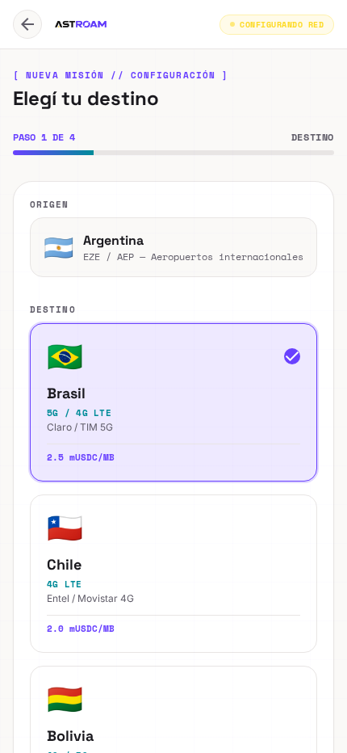
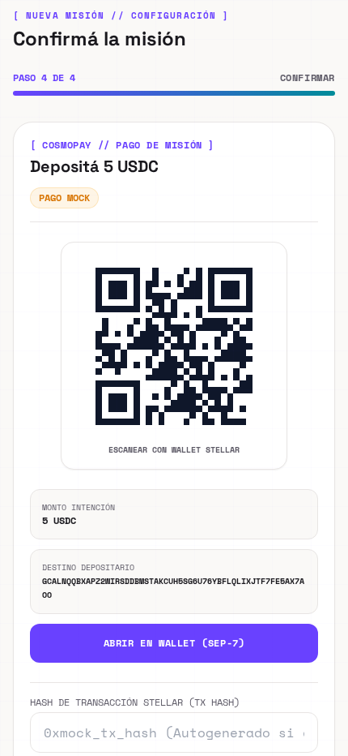
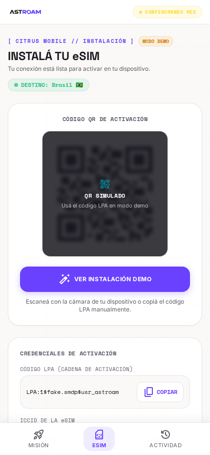
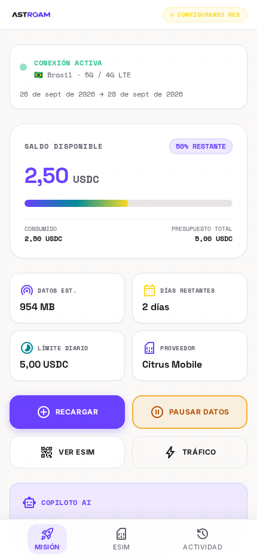
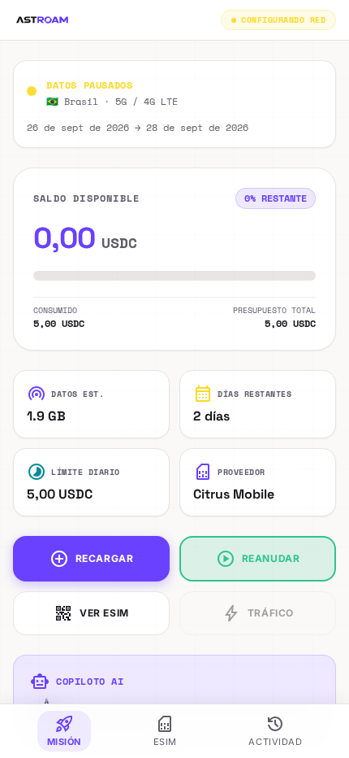

# AstroAm

**Datos móviles en cualquier país, pagados por MB con USDC en Stellar. Pagás lo que usás; lo que sobra vuelve a tu wallet.**

El viajero deposita USDC en un canal de pago de Soroban y recibe una eSIM. A
medida que navega, un agente firma vales acumulativos por lo consumido, sin
una transacción por cada MB. Al cerrar, el servidor cobra con el último vale
en una sola transacción y el resto del depósito vuelve al viajero.

[Landing](https://bright-figolla-0a9725.netlify.app/) · [Video](#video-de-presentación) · [Qué hace](#qué-hace) · [Evidencia en testnet](#uso-real-en-testnet) · [Correrlo local](#correrlo-local)

Hackatón **Stellar Apex**, equipo AstroAm: [@FrancoDuran23](https://github.com/FrancoDuran23),
[@DanielPalermoo](https://github.com/DanielPalermoo), [@ignaMartin22](https://github.com/ignaMartin22),
[@Joel010999](https://github.com/Joel010999). Pagos probados en Stellar
testnet; la app corre de punta a punta con eSIM y pagos simulados (ver
[Estado](#estado)).

<table>
  <tr>
    <td></td>
    <td></td>
    <td></td>
    <td></td>
    <td></td>
  </tr>
  <tr>
    <td>Destino y tarifa</td><td>Depósito USDC</td><td>eSIM</td><td>Consumo</td><td>Corte al agotar</td>
  </tr>
</table>

## Video de presentación

Presentación y demostración de AstroAm para la hackatón de Stellar. En el video se detalla el problema del roaming tradicional, la arquitectura basada en canales de pago en Soroban con micropagos en USDC por MB consumido y el recorrido de la aplicación de punta a punta.

[](https://youtu.be/f3AqEcRCN2g)

Ver en YouTube: [https://youtu.be/f3AqEcRCN2g](https://youtu.be/f3AqEcRCN2g)

## Qué hace

1. **Destino y presupuesto.** El viajero elige a dónde va, cuántos días y
   cuánto USDC quiere poner. Cada destino tiene su tarifa por MB (Brasil:
   0,0025 USDC/MB, o sea 5 USDC ≈ 2.000 MB).
2. **Depósito.** Paga con su wallet Stellar (intención de pago SEP-7 vía
   CosmoPay). El depósito queda en un canal de pago de una sola vía en
   Soroban: el viajero es el *funder*, AstroAm el *recipient*.
3. **eSIM.** Se la pedimos a Citrus Mobile por API y le mostramos el QR y el
   código LPA. La eSIM queda instalada para los próximos viajes.
4. **Consumo y vales.** Cada lectura de consumo pasa al medidor, que le pide
   al agente de pagos un vale firmado por el **acumulado** (`POST /vouchers`).
   La cuota de datos solo se acredita con un vale firmado; si el depósito no
   alcanza, el agente responde `channel_exhausted` y la política suspende la
   eSIM.
5. **Cierre.** El servidor cobra con el último vale en una sola transacción;
   el contrato devuelve el resto al viajero en esa misma transacción.
   Retiramos lo que quedó en la billetera de la eSIM y la deshabilitamos.

## Qué lo hace distinto

- **Sin packs que vencen.** Un pack de 1 GB se pierde si usaste 300 MB. Acá
  se cobra por MB y lo no usado vuelve on-chain al cerrar el canal.
- **Sin tarjeta.** Se paga con USDC desde la wallet: sin recargos por compras
  en el exterior ni tarjetas rechazadas.
- **Una transacción, no una por MB.** Los vales se firman off-chain y son
  acumulativos: el último reemplaza a todos los anteriores. El cobro es una
  sola transacción, pague 1 MB o 2 GB.
- **Sin VPN ni gateway propio.** La medición y el corte los hace el proveedor
  de eSIM; nosotros ponemos el canal, los vales y el reembolso
  ([decisión](docs/decisiones/medicion-con-proveedor.md)).
- **Cualquier país.** Citrus Mobile cubre 218 destinos con precio por país.

## Arquitectura

```
src/
  agent/        agente de pagos (funder): firma vales, POST /vouchers
  server/       servidor de cobro (recipient): verifica vales, cierra el canal, monitor de disputas
  shared/       precios, mensajes M1/M2, razones, reintentos, contrato del canal
  persistence/  registro de vales, del canal y de eSIMs
  config/       variables de entorno y arranque fail-closed
  providers/    proveedores de eSIM: CitrusProvider (real) y FakeProvider (demo)
  services/     política de corte, fondeo, cierre de sesión, webhooks de Citrus, CosmoPay
  meter/        medidor: pide el vale y acredita solo con firma
  product/      API de misiones que usa la app (/api/missions)
  jobs/         reconciliación de consumo
frontend/       app (React + Vite + Tailwind)
scripts/        demos, preflight y verificación de depósitos
docs/           diseño, decisiones y guías
```

| Componente | Qué hace | Dónde |
|---|---|---|
| Canal de pago | Contrato *one-way channel* de Soroban: depósito del funder, cierre del recipient con el vale más alto, salida unilateral del funder (`close_start` → `refund`). | `src/shared/stellar/`, `src/agent/channel.ts` |
| Agente de pagos | Firma vales ed25519 por el monto acumulado. Idempotente: el mismo acumulado devuelve el mismo vale (`reused`), uno menor es `stale_reading`, uno mayor al depósito es `channel_exhausted`. | `src/agent/` |
| Servidor de cobro | Verifica cada vale contra el canal, guarda el más alto y cierra el canal comprobando la trustline y el balance. Vigila disputas del funder. | `src/server/` |
| Medidor | Por cada lectura arma el pedido (M1), valida la respuesta (M2) y solo acredita cuota con un vale firmado que cubra la lectura. | `src/meter/` |
| Proveedor de eSIM | Alta de eSIM, QR/LPA, suspender/reanudar, billetera por eSIM (`fund`/`defund`), consumo y webhooks. | `src/providers/connectivity/` |
| API de misiones | Crear misión, intención de pago, confirmar, activar, consumo, pausar, recargar, terminar. | `src/product/` |

**Stack.** Node ≥22.18 con TypeScript ejecutado directo (sin build),
Express 5, `@stellar/stellar-sdk` 15.1.0, `@stellar/mpp` 0.7.1, `mppx` 0.6.29,
zod 4. App: React 18, Vite 5, Tailwind 3. Tests con `node:test`, sin
framework.

**Montos.** Todo se maneja en *raw units* de USDC (1 raw = 1e-7 USDC) como
`BigInt`, nunca `Number`. El precio del vale es por MiB (`PRICE_PER_MIB_RAW`)
y el de la política por MB (`PRICE_PER_MB_RAW`); el medidor no arranca si no
son la misma tarifa.

## Precio

Tarifa pública de Citrus Mobile del país × 1,35 (≈ 33% de margen sobre la
tarifa de revendedor, que es 10% más baja).

| País | Citrus (USD/GB) | AstroAm (USD/GB) | USDC/MB |
|---|---:|---:|---:|
| Brasil | 1,84 | 2,48 | 0,0025 |
| Argentina | 1,89 | 2,55 | 0,0026 |
| México | 2,00 | 2,70 | 0,0027 |
| EE.UU. | 0,97 | 1,31 | 0,0013 |
| España, Italia, Francia, Reino Unido | 0,61 | 0,82 | 0,0008 |

Tarifas de [citrusmobile.com/rates](https://citrusmobile.com/rates),
consultadas el 23/9/2026. Chile y Bolivia tienen precios provisorios en la
app: Citrus no los publica y se ven con cuenta (`GET /rates`).

## Direcciones (Stellar testnet)

| Qué | Dirección |
|---|---|
| USDC (Stellar Asset Contract) | `CBIELTK6YBZJU5UP2WWQEUCYKLPU6AUNZ2BQ4WWFEIE3USCIHMXQDAMA` |
| Canal de demo #2 (5 USDC, abierto) | `CDR5FGVHHVYHJKBWW7BOZWNC2LA7EHKZ54TQIZPA4SRQ4X7MUPMUKU4S` |
| Canal #3 (ciclo completo, cerrado) | `CCMCUTEJAHVPVURVDK6KAVH4VYQPDDRMCMWLVVEIJZ27XUVTMDITFRMU` |
| Recipient / fee payer | `GDSWY2JKMCUVGA7WADKCPTER436752X2P3UR5R7UGD6M2I7NIYNS6XIO` |
| Wasm del canal (hash) | `f9b7fdf860ce427097226f45f72b336763ca55d46c967076a94eb9682d8c484b` |

## Estado

- **Probado en testnet:** cobro puntual con fee pagado por el recipient
  (etapa 1), y canal de pago completo: apertura, recarga, vales firmados y
  verificados, cierre con reembolso y salida unilateral del funder (etapa 2).
- **Implementado, sin probar contra el servicio real:** `CitrusProvider`,
  webhooks, fondeo y cierre de la billetera de la eSIM. Falta abrir la cuenta
  de Citrus (no tiene sandbox).
- **Simulado en la app:** eSIM (`FakeProvider`), pago con CosmoPay y un agente
  de pagos por misión. Los vales tienen el formato real pero una firma de
  mentira; el flujo y los montos son los mismos.
- **Falta:** `settle` (cobros parciales sin cerrar el canal), modo live de
  la app contra testnet, y publicar la app.

## Uso real en testnet

Etapa 1 (15/9/2026): dos cobros de 1 MiB cada uno, con el recipient pagando
el fee. El saldo en XLM del agente no cambió.

| Qué | Monto | Transacción |
|---|---|---|
| Cobro 1 (0 → 1 MiB) | 0,001 USDC | [`57c29984…`](https://stellar.expert/explorer/testnet/tx/57c29984c496263d9a057d33f8da3e350e8ec7a6ef704a8cb5b2dfd630e89263) |
| Cobro 2 (1 → 2 MiB) | 0,001 USDC | [`2b75ec8d…`](https://stellar.expert/explorer/testnet/tx/2b75ec8dd87011de3b2104029ea1e4c5819845780a3aedbe4414398609f5b9d0) |

Etapa 2 (16/9/2026): canal #3, ciclo completo.

| Qué | Monto | Transacción |
|---|---|---|
| Apertura del canal | depósito 1 USDC | [`6c7f3d37…`](https://stellar.expert/explorer/testnet/tx/6c7f3d374a6ca2a6532cdb51518ef46fc2c88f4637e4d95ee1ca26f17ee77072) |
| Vale firmado (off-chain) | 0,1 USDC | — |
| Cierre | recipient +0,1 USDC, funder +0,9 USDC, misma transacción | [`c5bc9bc4…`](https://stellar.expert/explorer/testnet/tx/c5bc9bc4f8895a356edaff47552ad7d52da4736a42fe9d3c92fdab2e0497c339) |

Contra el canal #2 (5 USDC) se probaron todas las respuestas del agente: dos
vales nuevos, el mismo acumulado otra vez (`reused`), uno menor
(`stale_reading`) y uno por encima del depósito (`channel_exhausted`).
Detalle completo en [`docs/sdd/payments-mpp.md`](docs/sdd/payments-mpp.md) §6.

## Riesgos, dichos de frente

- **Citrus informa el consumo en USD cobrados, no en bytes.** Los bytes se
  calculan dividiendo por la tarifa del país; la precisión se confirma recién
  con una cuenta real.
- **Citrus no tiene sandbox.** Toda prueba contra la API cuesta plata real
  (recarga mínima USD 4), y todavía no la hicimos.
- **Citrus también vende directo al viajero, más barato que nosotros.** No
  competimos por precio contra el mayorista: competimos con USDC sin tarjeta
  y el reembolso automático.
- **Sin `settle`.** El único wasm desplegable hoy no tiene cobros parciales:
  el recipient cobra solo al cerrar. Un servidor maneja un canal por proceso.
- **Desfase de ~10 minutos** entre el uso y el vale. Lo acota la billetera
  prepaga de la eSIM: nunca se consume más de lo que se cargó.
- **Modo live incompleto.** Con `ASTROAM_LIVE_ENABLED=true` el backend exige
  un token en cada operación que cambia datos, y la app todavía no lo envía:
  hoy la app solo funciona en modo demo.
- **Pago simulado.** En modo demo, la confirmación de CosmoPay acepta
  cualquier hash de transacción.
- **Sin auditoría** de los contratos ni del código.

## Correrlo local

Requiere Node ≥22.18.

**App completa (sin claves):**

```bash
cp .env.example .env
npm install
npm run server                         # backend en http://localhost:8080

cd frontend && npm install && npm run dev   # app en http://localhost:5173
```

No crees `frontend/.env`: sin `VITE_API_BASE_URL`, Vite reenvía `/api` al
backend. Dejá `ASTROAM_LIVE_ENABLED=false`. En la misión activa, cada toque
de **TRÁFICO** consume 250 MB (5 USDC en Brasil se agotan en 8 toques).

**Chequeos:** `npm run check` (tipos) y `npm test` (tests). En el frontend:
`npx tsc --noEmit`.

**Pagos contra testnet** (servidor, agente y canal reales): ver
[`docs/payments-mpp-operacion.md`](docs/payments-mpp-operacion.md).

## Scripts útiles

| Script | Qué hace |
|---|---|
| `npm run server` | Servidor de cobro + API de misiones de la app. |
| `npm run agent:serve` | Agente de pagos con `POST /vouchers`. |
| `npm run demo:flow` | Viajero en Florianópolis por consola: 4 tramos, vales, tope y corte. Con `AGENT_VOUCHERS_URL` usa el agente real. |
| `npm run demo:cosmopay` | El mismo flujo, fondeado con CosmoPay. |
| `npm run channel:open -- --deposit <raw>` | Abre un canal en testnet (funder). |
| `npm run channel:state` | Estado del canal visto por el funder. |
| `npm run channel-admin:state` / `:close` | Estado del canal visto por el recipient / cerrarlo cobrando. |
| `npm run preflight` | Verifica trustlines de USDC antes de operar. |
| `node scripts/smoke-test-api.ts` | Recorre toda la API de misiones contra un servidor en memoria. |

## Documentos

| Leé esto | Para |
|---|---|
| [`docs/decisiones/medicion-con-proveedor.md`](docs/decisiones/medicion-con-proveedor.md) | Por qué medimos con el proveedor y no con un gateway propio. |
| [`docs/sdd/payments-mpp.md`](docs/sdd/payments-mpp.md) | Requisitos, diseño y evidencia en testnet del componente de pagos. |
| [`docs/payments-mpp-operacion.md`](docs/payments-mpp-operacion.md) | Operar el servidor, el agente y el canal. |
| [`docs/citrus-mobile-brief.md`](docs/citrus-mobile-brief.md), [`docs/citrus-mobile-spec.md`](docs/citrus-mobile-spec.md) | Brief y spec de la migración a Citrus Mobile. |
