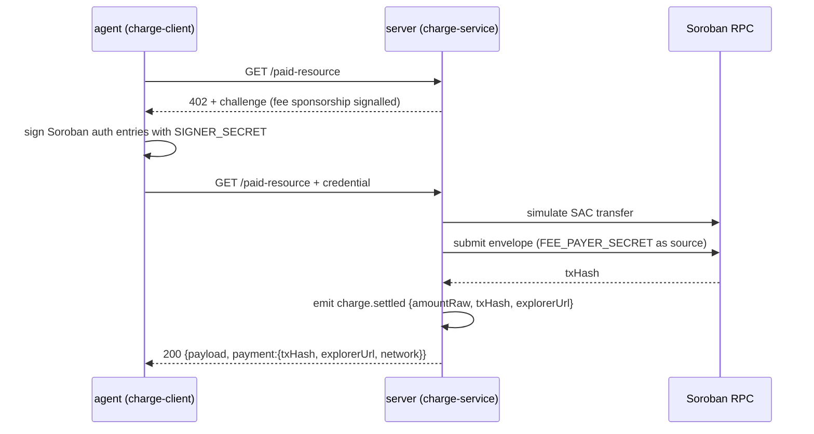
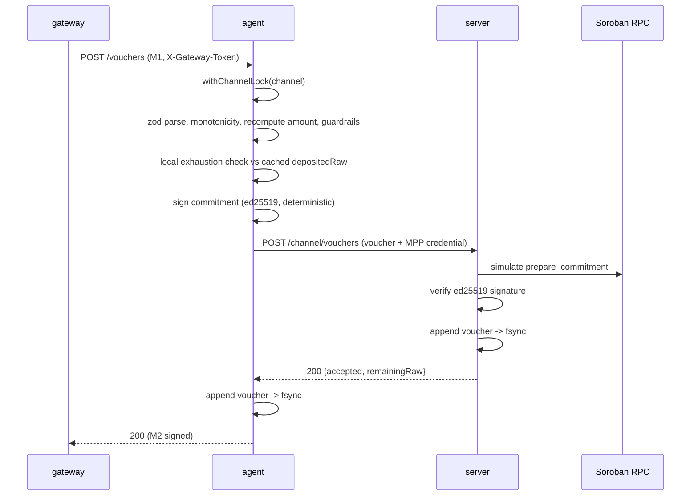

# SDD — Componente de pagos (payments-mpp)

Registro de todas las fases del SDD para leer de corrido. Fuente de requisitos: `docs/payments-sdd.md`. Artefactos de máquina en Engram bajo `sdd/payments-mpp/*`. Rama: `feat/payments-mpp`.

| Fase | Estado | Fecha |
|---|---|---|
| 1. Exploración | Cerrada | 2026-09-15 |
| 2. Propuesta | Cerrada | 2026-09-15 |
| 3. Especificación | Cerrada | 2026-09-15 |
| 4. Diseño | Cerrada | 2026-09-15 |
| 5. Tareas | Pendiente | |
| 6. Implementación | Pendiente | |
| 7. Verificación | Pendiente | |

## 1. Exploración (2026-09-15)

Investigación previa a la propuesta. Fuente de requisitos: `docs/payments-sdd.md` (español, repo vacío). Se verificó contra la documentación oficial de Stellar, el registro de npm y GitHub antes de escribir la propuesta. Artefactos de máquina: observación de Engram 790 (hallazgos A-G) y su addenda 791, que corrige a 790 donde difieren.

### Fuentes verificadas

- `developers.stellar.org/docs/build/agentic-payments/mpp/channel-guide` — guía oficial de sesión; documenta solo el cierre desde el servidor, no menciona plazo, costo ni reutilización.
- `github.com/stellar/stellar-mpp-sdk` — README del SDK; documenta la apertura por el funder (depósito + commitment_key + recipient) y el "refund waiting period".
- `github.com/stellar-experimental/one-way-channel` — README del contrato; fuente primaria de las funciones del contrato y sus autorizaciones.
- `registry.npmjs.org/@stellar/mpp` — versión publicada, peer dependencies declaradas, exports del paquete.
- `github.com/stellar/stellar-mpp-sdk/issues/70` — estado del issue de dependencias.
- StellarExpert y Lumenscan (testnet) — confirman emisor y contrato SEP-41 de USDC de testnet (docs/payments-sdd.md §8).

### Las cuatro respuestas del canal (§7)

Verificadas contra la guía oficial y el README del contrato `stellar-experimental/one-way-channel`, al que apunta el repo del SDK. La guía oficial solo documenta el camino del servidor; el del funder existe en el contrato. La observación 790 había marcado la autoridad de cierre como una contradicción sin resolver entre la guía oficial y una fuente comunitaria; 791 la resuelve: el camino del funder existe en el contrato, simplemente no está en la guía.

1. Cualquiera de los dos puede cerrar. El servidor (recipient) cierra con `close`, o cobra lo adeudado sin cerrar con `settle`. El usuario (funder) cierra solo, sin depender de nosotros: `close_start` y, cumplido el plazo, `refund`.
2. El plazo depende de quién cierra. Si cierra el servidor, el sobrante vuelve al funder en la misma transacción. Si cierra el funder, espera `refund_waiting_period` ledgers (unos 5 segundos por ledger); el valor lo fija el funder al abrir.
3. No hay salida automática, pero sí unilateral. Si nadie cierra, el saldo queda en el contrato hasta que el funder haga `close_start` + `refund`. Si el funder completa el `refund` antes de que el servidor cierre, el servidor pierde lo adeudado.
4. El costo no está documentado; se mide el día 1. El contrato es reutilizable (`top_up` o transferencia directa), así que "un canal por usuario, recarga por viaje" queda soportado sin cambiar el diseño.

### Superficie del SDK — escalón 1 (cobro puntual)

Fuentes: `developers.stellar.org/docs/build/agentic-payments/mpp` y `.../mpp/charge-guide`.

- Paquetes: `express`, `@stellar/mpp`, `mppx`, `@stellar/stellar-sdk` (`mppx` es peer obligatorio, no opcional).
- Servidor: `import { Mppx, Store } from "mppx/server"`, `import { stellar } from "@stellar/mpp/charge/server"`, `import { USDC_SAC_TESTNET } from "@stellar/mpp"`. Configuración: `Mppx.create({ secretKey: MPP_SECRET_KEY, methods: [stellar.charge({ recipient, currency: USDC_SAC_TESTNET, network: "stellar:testnet", store: Store.memory() })] })`.
- Variables de entorno: `STELLAR_RECIPIENT` (clave pública receptora), `MPP_SECRET_KEY` (secreto del protocolo MPP para verificación de credenciales, distinto de una clave secreta de cuenta Stellar).
- Flujo 402: un request sin autenticar devuelve `status === 402` con un desafío en los headers de la respuesta describiendo los requisitos de pago; el cliente arma la transferencia SAC de Soroban a partir de ahí.
- Verificación del servidor: simula la transferencia SAC (`simulate()` contra Soroban RPC) y luego transmite la transacción.
- Pull + sponsored: con `feePayer: { envelopeSigner: Keypair.fromSecret(FEE_PAYER_SECRET) }` en el método de cobro del servidor, este señala patrocinio de comisión al cliente vía el desafío; el cliente firma solo las entradas de autorización de Soroban, nunca el sobre completo, y no paga comisión de red.
- Cliente headless: `const keypair = Keypair.fromSecret(STELLAR_SECRET); Mppx.create({ methods: [stellar.charge({ keypair, mode: "pull", onProgress(event){...} })] })`. `Mppx` reemplaza el `fetch` global, así que el reintento tras el 402 es transparente.
- Modo push (no usado): el cliente transmite él mismo y manda una credencial `signedHash` (`"{challenge.id}:{hash}"`) firmada con su clave; el servidor acepta ambos tipos de credencial sin configuración extra.

### Superficie del SDK — escalón 2 (canal)

Fuente: `developers.stellar.org/docs/build/agentic-payments/mpp/channel-guide`, corregida por 791 con el README del contrato.

- Variables de entorno servidor: `CHANNEL_CONTRACT`, `COMMITMENT_PUBKEY`, `MPP_SECRET_KEY`. Cliente: `COMMITMENT_SECRET`, `SIGNER_SECRET`.
- Funciones del contrato (`one-way-channel`): `__constructor` (deployer, autorizado por el funder), `top_up` (funder; el canal es reutilizable), `settle` (recipient: cobra lo adeudado sin cerrar), `close` (recipient: liquida el monto del compromiso y hace `try_transfer` del sobrante al funder en la misma transacción; falla en silencio si el funder no puede recibir), `close_start` (funder), `refund` (funder, tras `refund_waiting_period` ledgers desde `close_start`), `prepare_commitment` (helper de verificación).
- Formato del vale (commitment): mapa XDR con `amount` (acumulado), `channel` (dirección del contrato), `domain` (`"chancmmt"`) y `network`; firma ed25519 con una clave separada de la cuenta Stellar. Sin nonce: el vale más nuevo reemplaza al anterior.
- Verificación del servidor: (1) simula `prepare_commitment` contra Soroban RPC — sin costo, de solo lectura; (2) verifica la firma ed25519 localmente; (3) actualiza el monto acumulado en su store. Sin costo on-chain por vale.
- Cierre: `import { close } from "@stellar/mpp/channel/server"`, invocado como `close({ channel, amount, signature, feePayer, network })`.
- El SDK no expone un hook de persistencia por vale. Solo ofrece `Store.memory()` para el monto acumulado y la protección contra repetición; persistir cada vale es responsabilidad de la aplicación (§11 del documento de requisitos).

### Versiones fijadas

| Paquete | Versión | Motivo |
|---|---|---|
| `@stellar/mpp` | `0.7.1` | última, exige Node >= 22, ESM |
| `@stellar/stellar-sdk` | `15.1.0` | coincide exacto con el peer declarado por `@stellar/mpp` (`^15.1.0`) |
| `mppx` | `0.6.29` | coincide con el piso del peer declarado (`^0.6.29`) |
| `viem` | según el peer de `mppx` | peer obligatorio de `mppx@0.6.x` (`>=2.50.4`) |
| `zod` | fijado explícito | `@stellar/mpp` depende de `zod ^4.4.3`; se declara en vez de dejarlo transitivo |

El ecosistema ya está en `stellar-sdk` 17.x y `mppx` 0.9.x, dos versiones mayores por delante de lo que `@stellar/mpp@0.7.1` declara como peer. Una instalación limpia sin fijar versiones resuelve dos copias del SDK (issue #70, `github.com/stellar/stellar-mpp-sdk/issues/70`). El issue está **cerrado desde el 04/09, sin cambio de rangos** — corrección de 791 sobre 790, que lo había marcado como abierto. Tras instalar, `npm ls @stellar/stellar-sdk mppx` no debe mostrar duplicados.

### Comparación de enfoques

| Enfoque | Tx on-chain por pago | Quién paga comisión | ¿Facilitador externo? | Devolución del sobrante | Madurez / riesgo | Ajuste al consumo medido por bytes |
|---|---|---|---|---|---|---|
| MPP charge (escalón 1) | 1 por request | Servidor (sponsored/feePayer) | No | No aplica (sin prefondeo) | Simple, bien documentado, riesgo bajo | Pobre a escala (liquidación por request es charlatana) pero excelente como smoke test |
| MPP channel (escalón 2) | 1 apertura + 1 cierre, N vales fuera de cadena | Servidor paga el cierre (sponsored); funder paga solo el depósito inicial | No | Sí, automática al cerrar (sobrante al funder) | Más nuevo (QuickNode lo usa en producción), issue #70 de dependencias es riesgo de integración, no de protocolo | Muy buen ajuste: el consumo continuo mapea directo a vales acumulativos, sin trabajo de idempotencia |
| x402 (escalón 3) | 1 por request (mediado por facilitador) | Facilitador/sponsored | Sí (Coinbase u OpenZeppelin) | No aplica (sin concepto de canal) | Quickstart oficial completo; protocolo distinto, agrega una tercera superficie de dependencias | Misma limitación de charla por request; solo útil como casillero de compatibilidad con el estándar |

### Puntos de atención

- **El reembolso al cerrar puede fallar en silencio.** `close` usa `try_transfer` para devolver el sobrante; si el funder perdió la línea de confianza de USDC, el sobrante no vuelve y no hay error.
- **Lo adeudado se pierde si el funder reembolsa primero.** Si el funder completa `refund` antes de que el servidor haga `close` o `settle`, el servidor pierde lo adeudado; debe vigilar `close_start` y liquidar antes.
- **Sin costo on-chain por vale**, pero cada verificación de vale cuesta una simulación de `prepare_commitment` contra Soroban RPC (de solo lectura, sin transacción).

## 2. Propuesta (2026-09-15)

Fuente de verdad: `docs/payments-sdd.md`. Verificada contra la exploración (Engram 790) y su addenda (791); donde difieren, gana 791. Prosa técnica traducida al español para este registro; identificadores, variables de entorno, JSON, rutas y códigos de estado se mantienen en inglés tal como en la propuesta original (Engram 792).

### 2.1 Intención

**Problema.** Un producto de conectividad cobra por bytes consumidos. La promesa comercial es *"depositás lo que quieras, pagás solo lo que consumís, lo que sobra vuelve solo."* Las transferencias on-chain por request no pueden cumplir esa promesa: no hay saldo prefondeado, así que no hay nada que "vuelva", y una transacción por cobro es inviable para medición continua. Un canal de pago unidireccional en Soroban entrega la promesa como **propiedad del contrato**, no como código que escribimos y pedimos que se confíe.

**Por qué ahora.** Dos fechas duras: jueves 2026-09-17 (escalón 1) y lunes 2026-09-22 (escalón 2). Un compañero construyendo el medidor/gateway está bloqueado esperando un contrato de interfaz que debe congelarse el miércoles. El repositorio está vacío: cero commits, sin `package.json`.

**Éxito.** Una corrida en vivo el Demo Day donde el depósito, el corte de servicio al agotarse y la devolución automática del sobrante sean visibles cada uno en un explorador de testnet, con el escalón 1 ya cerrado como respaldo garantizado.

**Límite del componente (§16).** Este componente cobra. No mide bytes, no administra conectividad, no administra usuarios, no carga saldo, no dibuja nada. Habla con el gateway por HTTP y emite eventos al backend.

### 2.2 Alcance por escalón

**Escalón 1 — Cobro puntual on-chain (vence jueves 2026-09-17)**

| Dentro de alcance | Fuera de alcance |
|---|---|
| Servidor de juguete devolviendo desafío 402 | Contrato de canal, depósitos, vales |
| `charge` de MPP en modo **pull + sponsored** (el servidor paga la comisión) | Modo push |
| Cliente agente headless desde una clave secreta, sin billetera de navegador | Cualquier UI |
| Cobros repetidos contra consumo simulado | Integración real con el gateway (llega días 3-4) |
| Corte limpio cuando el cobro no puede hacerse | |

**Cerrado solo cuando** hay un hash de transacción visible en un explorador de testnet. No antes.

**Escalón 2 — Canal de pago (vence lunes 2026-09-22)**

| Dentro de alcance | Fuera de alcance |
|---|---|
| Apertura y depósito del canal (autorizado por el funder, on-chain) | Mainnet, fondos reales |
| Vales acumulativos fuera de cadena, uno por lectura del medidor | Liquidación on-chain por vale |
| Persistencia de vales y repetición al reiniciar | Base de datos de usuarios/sesiones |
| Detección de agotamiento y corte limpio | Reintento al agotarse (eso es la demo, no un error) |
| `close` del servidor (liquida y devuelve el sobrante en una tx) | UI del lado del funder para `close_start`/`refund` |
| Poller de `close_start` + `settle` por umbral | Tests de integración automatizados contra testnet |
| Reutilización vía `top_up` | Un canal por viaje |

**Escalón 3 — x402**

**Fuera de este cambio por completo.** Se convierte en un cambio SDD separado, iniciado solo si el escalón 2 cierra antes de tiempo. *"Si sobra. Se menciona, no se construye."* **Asumido, confirmar con el equipo** (ver pregunta abierta 6).

**Fuera de alcance en todos los escalones:** medición de bytes; gateway/conectividad; administración de usuarios; UI de carga de saldo; cualquier UI. Gestión de claves multi-tenant, HSM, rotación de claves. CI contra testnet. Stack de métricas/tracing (solo líneas JSON por stdout). Tarifas de producción (listas de precios firmadas, tarifas dinámicas). Recuperar fondos cuando el funder perdió la línea de confianza de USDC: solo detectar y alertar.

### 2.3 Enfoque

**2.3.1 Arquitectura general**

Tres procesos. El medidor/gateway es del compañero; los otros dos son nuestros. **Asumido, confirmar con el equipo:** que el agent sea un proceso separado del gateway, hablando por HTTP (ver pregunta abierta 5).

```
[gateway/meter]  --HTTP POST /vouchers-->  [agent]  --HTTP-->  [payment server]
  (teammate)      <--signed | unsigned--             <--------   (recipient)
                                                                     |
                                                            Soroban RPC (testnet)
                                                            one-way-channel contract
                                                                     |
[backend] <-- events (stdout JSON line, optional webhook) -----------+
```

- **agent** — el funder/pagador. Tiene `COMMITMENT_SECRET` y `SIGNER_SECRET`. Firma compromisos acumulativos, abre y recarga el canal, nunca paga comisión de red.
- **payment server** — el recipient. Tiene `CHANNEL_CONTRACT`, `COMMITMENT_PUBKEY`, `MPP_SECRET_KEY`. Verifica vales por simulación de `prepare_commitment` + verificación ed25519, los persiste, llama a `settle`/`close`.

**Simplificación clave para el compañero:** los dos mensajes del §4 del documento de requisitos son el **cuerpo del request y el cuerpo de la respuesta de una sola llamada HTTP**. Sin callbacks, sin cola, sin segundo endpoint. El salto agent→server es interno e invisible para el gateway.

**2.3.2 Límites de módulos (un solo paquete npm, límites por carpeta)**

```
src/
  shared/       pricing math (BigInt ceilDiv), message schemas (zod), event envelopes, reason enum
  agent/        commitment signing, guardrails, open/top_up, HTTP server exposing POST /vouchers
  server/       402 challenge, charge verification (stage 1), voucher store, settle/close, close_start poller
  persistence/  append-only voucher log + boot replay index
  events/       emit() -> stdout JSON line + optional webhook queue
  config/       env parsing, validation, fail-closed instance builder
```

`shared/` es el único módulo que importan tanto `agent/` como `server/`. El escalón 1 ejercita `shared/`, `config/`, `events/` y el camino de cobro del servidor; el escalón 2 agrega `persistence/` y los caminos del canal. **El código de precios del escalón 1 es el código de precios del escalón 2** — esa reutilización es lo que hace realista la progresión jueves→lunes.

**2.3.3 Contrato de mensajes 1 — gateway/meter → agent**

`POST /vouchers` (agent), header `X-Gateway-Token: <shared secret>`.

```json
{
  "version": 1,
  "sessionId": "sess_01JBQ7X3M2",
  "channel": "CB...56chars",
  "network": "stellar:testnet",
  "asset": "USDC",
  "cumulativeBytes": 1048576,
  "cumulativeAmount": "125000",
  "meterReadingId": "mr_000042",
  "observedAt": "2026-09-17T14:03:11.204Z"
}
```

| Campo | Regla |
|---|---|
| `cumulativeBytes` | Entero, total de bytes **desde la apertura del canal**, nunca desde el último request. Monótono no decreciente. |
| `cumulativeAmount` | **String** de unidades raw i128 de SEP-41, 7 decimales. `"125000"` = 0.0125 USDC. Nunca un número (excede `Number.MAX_SAFE_INTEGER`), nunca un string decimal como `"0.0125"`. |
| `meterReadingId` | Correlación solo para logs. **No** es la clave de idempotencia. |
| `channel` | Omitido en el escalón 1 (modo charge); requerido en el escalón 2. |

**La idempotencia sale del monto acumulado, gratis**, tal como predecía el §4: *"un vale nuevo reemplaza al anterior, así que un reintento no cobra dos veces."*

| `cumulativeAmount` entrante vs el más alto firmado | Comportamiento del agent |
|---|---|
| Igual | Devuelve el vale guardado, `reused: true`. Sin refirmar, sin nueva línea de log. |
| Mayor | Firma un vale nuevo, lo persiste, devuelve `reused: false`. Reemplaza al anterior. |
| Menor | Rechaza `stale_reading`, `retryable: false` — el gateway perdió estado y debe resincronizar. |

Ed25519 es determinístico (RFC 8032), así que refirmar el mismo monto daría la misma firma de todos modos; `reused` es una bandera de observabilidad, no el mecanismo de corrección.

**Tasa de llamadas:** el gateway llama a esto como máximo una vez por `METER_REPORT_INTERVAL` (recomendado 10 s) o al cruzar un umbral de bytes — nunca por paquete. El agent serializa los requests **por canal** con un mutex para que dos lecturas no compitan sobre el acumulado.

**2.3.4 Contrato de mensajes 2 — agent → gateway (la respuesta HTTP)**

Firmado:

```json
{
  "version": 1,
  "status": "signed",
  "sessionId": "sess_01JBQ7X3M2",
  "channel": "CB...",
  "voucher": {
    "cumulativeAmount": "125000",
    "signature": "<128 hex chars>",
    "commitmentPubkey": "<64 hex chars>",
    "network": "stellar:testnet"
  },
  "meterReadingId": "mr_000042",
  "reused": false,
  "remaining": "9875000",
  "signedAt": "2026-09-17T14:03:11.402Z"
}
```

No firmado:

```json
{
  "version": 1,
  "status": "unsigned",
  "sessionId": "sess_01JBQ7X3M2",
  "channel": "CB...",
  "reason": "channel_exhausted",
  "retryable": false,
  "remaining": "0",
  "meterReadingId": "mr_000042",
  "detail": "requested cumulative 125000 exceeds channel deposit 100000"
}
```

**Enum `reason`** — los dos tipos de falla del §12 hechos legibles por máquina:

| `reason` | `retryable` | Acción del gateway | HTTP |
|---|---|---|---|
| `channel_exhausted` | false | **Corta el servicio.** Esto es la demo, no un error. | 200 |
| `channel_closing` | false | Corta — el funder ejecutó `close_start`. | 200 |
| `channel_not_found` / `channel_not_open` | false | Corta — error de configuración. | 200 |
| `stale_reading` | false | Resincroniza el estado acumulado, no reintenta tal cual. | 200 |
| `amount_rejected` | false | Corta — saltó un guardrail (ver 2.4 D5). | 200 |
| `signer_unavailable` | true | Backoff y reintento. | 503 |
| `upstream_unavailable` | true | Backoff y reintento (Soroban RPC caído). | 503 |
| `internal_error` | true | Backoff y reintento. | 503 |

Dos decisiones deliberadas acá:

1. **`retryable` es un booleano explícito, no algo que el gateway derive del enum.** La rama del gateway es un solo campo: `if (!retryable) cut(); else backoff();`. Agregar un motivo nuevo después no obliga al compañero a publicar una tabla de mapeo nueva.
2. **El código HTTP transmite solo "¿puedo preguntarte de nuevo?", nunca el resultado de negocio.** `signed` y `unsigned` no reintentable son ambos 200 porque ambos son *respuestas*. 503 (con `Retry-After`) significa solo "preguntame después" — lo que hace preciso, no vago, el *"devuelve 503 por request"* del §11. Tradeoff: un revisor puede esperar 402/409 para agotamiento; un 4xx invitaría a un middleware HTTP genérico de reintento a reintentar una decisión que nunca debe reintentarse.

**2.3.5 Ciclo de vida del canal mapeado a los momentos del producto (§6)**

| Momento del §6 | Línea del producto | Llamada al contrato | Actor | On-chain | Evento |
|---|---|---|---|---|---|
| Configuración previa al viaje | *"depositás lo que quieras"* | `__constructor` (primera vez) o `top_up` | funder | 1 tx, visible en el explorador | `channel.opened` / `channel.topped_up` |
| Consumo | *"pagás solo lo que consumís"* | simulación de `prepare_commitment` + verificación ed25519 local | agent → server | ninguno | `usage.voucher_signed` |
| Canal agotado | corte de servicio | ninguna | agent | ninguno | `channel.exhausted` |
| Fin de viaje | *"lo que sobra vuelve solo"* | `close(channel, highestCumulative, signature, feePayer)` — liquida lo adeudado y hace `try_transfer` del sobrante al funder en la **misma tx** | server | 1 tx | `channel.closed` |
| Válvula de escape | *"no dependés de nosotros"* | `close_start` → espera `refund_waiting_period` → `refund` | funder | 2 tx | `channel.closed` (`closedBy: "funder"`) |
| Protección del servidor | — | vigila `close_start`; `settle` sobre umbral | server | 1 tx si se dispara | — |

`refund_waiting_period` lo fija **el funder al abrir**. El camino feliz de la demo es un `close` iniciado por el servidor, donde el sobrante vuelve de inmediato y el plazo de espera nunca aplica.

### 2.4 Decisiones

**Supuestos que quedan marcados como pendientes de confirmar con el equipo:** D6 (`refund_waiting_period` = 60 ledgers y un canal por usuario reutilizado con `top_up`), el precio `PRICE_PER_MIB_RAW` en D4, el canal de eventos en D8 (línea de log con webhook opcional vía `BACKEND_EVENTS_URL`), que el agent sea un proceso separado del gateway hablando por HTTP (2.3.1), y que x402 quede fuera de este cambio (2.2). Cada uno se marca en su lugar más abajo y se repite en las preguntas abiertas (2.7).

**D1 — TypeScript con type stripping de Node, sin paso de build**
Recomendación: fuentes `.ts` corren directo en Node (`>=22.18`, donde el type stripping está activo por defecto), `tsc --noEmit` como script de chequeo, `erasableSyntaxOnly` en el tsconfig (sin enums, sin parameter properties, sin namespaces).
Tradeoff: los tipos detectan desvíos del contrato meter/gateway mientras se edita, no en el momento de la demo — `@stellar/mpp` publica tipos y valida con zod, así que la superficie del SDK viene gratis; el costo es la restricción de sintaxis erasable y un paso de chequeo que un compañero apurado puede saltear.
Verificación día 1: `node --version` + correr un archivo `.ts`. Si la máquina es anterior a 22.18, agregar `--experimental-strip-types` a los scripts. No es una decisión de producto, no necesita confirmación.

**D2 — Un solo paquete npm, límites por carpeta (no workspaces)**
Recomendación: un `package.json`, un `node_modules`, un solo grafo de dependencias; límites como carpetas (2.3.2).
Tradeoff: nada impide mecánicamente que `server/` importe internals de `agent/` — pero workspaces agregaría una segunda superficie de hoisting sobre el **problema ya conocido de SDK duplicado** (issue #70). Con una ventana de 7 días, un solo grafo de resolución le gana a un límite forzado. Revisar solo si el agent se publica como artefacto separado.

**D3 — Log de vales JSONL append-only, persistir antes de confirmar**
Recomendación: `data/vouchers-<network>.jsonl`, una línea por vale **aceptado**; un índice en memoria de "acumulado más alto por canal" reconstruido al reiniciar leyendo el archivo.
Registro: `{ts, channel, cumulativeAmount (string), signature (hex), cumulativeBytes, meterReadingId, network}`.
Regla de orden (crítica): agregar → `fsync` → *recién entonces* devolver 200. Un crash entre confirmar y escribir pierde exactamente lo que el §11 advierte: *"si se pierde el último vale firmado, se pierde lo cobrado desde el anterior."*
Se guarda historial completo y no solo el último: un archivo append-only no tiene el modo de falla "una escritura parcial destruye el único registro", una línea final corrupta cae al último valor válido anterior (WARN, sigue sirviendo), y la cinta de vales es buen material de demo.
Tradeoff: se descartó `better-sqlite3` (build nativo; node-gyp en Windows es una trampa de hackathon) y `node:sqlite` (superficie experimental, sin beneficio a esta escala). Costo: sin queries — aceptable, la única consulta es "el más alto por canal".

**D4 — El gateway es la única autoridad de precio; el agent la acota**
**Asumido, confirmar con el equipo:** el valor de `PRICE_PER_MIB_RAW` y quién lo fija (el dueño del gateway, por recomendación) — ver pregunta abierta 3.
Recomendación: el mensaje 1 lleva **ambos** `cumulativeBytes` y `cumulativeAmount`; el gateway es autoridad sobre el monto. El agent no inventa un precio — recalcula la misma función pura como contraverificación y aplica guardrails antes de firmar.
Tradeoff: dos implementaciones de precio independientes eventualmente discreparían y la discrepancia sería invisible; una sola autoridad más una contraverificación de coincidencia exacta convierte un desvío silencioso en un `amount_rejected` ruidoso en el primer request. Producción reemplazaría esto con una lista de precios firmada.

**D5 — Todo el dinero es un string de unidades raw i128 a 7 decimales**
Recomendación:
- `PRICE_PER_MIB_RAW` — unidades raw enteras por MiB, config compartida en ambos lados.
- `cumulativeAmount = ceilDiv(cumulativeBytes * PRICE_PER_MIB_RAW, 1048576n)` en BigInt.
- Redondeo hacia **arriba**, calculado **desde el total** cada vez, nunca acumulado desde deltas por request.
- Unidad mínima facturable = 1 unidad raw (1e-7 USDC). Sin piso por request — un piso rompería el recálculo desde el total.
- Chequeo del lado del agent: recalcula y exige igualdad exacta; si no coincide ⇒ `amount_rejected`, no reintentable.
Tradeoff: el redondeo hacia arriba nunca subfactura y mantiene la función monótona; como se recalcula desde el total acumulado, **el error de redondeo total de una sesión entera es como máximo una unidad raw**, no una por request. Esta es la propiedad que hace verdadero, y no solo deseable, que "el medidor y el vale nunca puedan discrepar".
Reutilización del escalón 1: el cobro por request es `cumulative(now) - cumulative(previous)` a través de la misma función.

**D6 — Un canal por usuario, reutilizado vía `top_up`; `refund_waiting_period` = 60 ledgers; `settle` por evento**
**Asumido, confirmar con el equipo.**
Recomendación:
- Un canal por usuario, recargado por viaje. El contrato es reutilizable (`top_up`) y el costo de apertura sigue sin medirse (§7 pregunta 4); canales por viaje multiplicarían tanto el costo como la exposición al reembolso. El momento "configuración previa al viaje" del §6 sigue mostrando una transacción on-chain visible en el explorador; es un `top_up` en vez de un deploy nuevo.
- `refund_waiting_period` = 60 ledgers ≈ 5 minutos. Suficientemente corto para demostrar el reembolso unilateral en vivo sin tiempo muerto; suficientemente largo para que un poll de 30 s tenga unas 10 oportunidades de detectar `close_start`.
- Cadencia de `settle`: por evento como vía principal, por umbral como respaldo, sin timer. Se vigila el estado del canal cada `CHANNEL_POLL_INTERVAL_MS` (30 s); al detectar `close_start`, se hace `close` de inmediato con el vale más alto. Independientemente, se hace `settle` cuando lo adeudado sin liquidar supera el 50% del depósito.
Tradeoff: un plazo más corto es mejor discurso pero reduce la ventana de reacción del servidor; según 791, *"si el funder completa el refund antes de que el servidor cierre, el servidor pierde lo adeudado."* Liquidar por timer gastaría una transacción en cada tick sin protección adicional.
Supuesto sin verificar — verificar día 5: que un `close_start` pendiente y su plazo sean legibles por simulación. Si no lo son, caer a `settle` con umbral del 25% más un timer de 2 minutos, y decirlo en el guion de la demo.

**D7 — Fallar cerrado: escuchar primero, inicializar después, rearmar bajo demanda**
Recomendación:
- `app.listen()` **antes** de construir la instancia de pago. El proceso siempre es alcanzable. Esta es la forma concreta de *"un servidor que no levanta es una demo perdida; uno que devuelve 503 se diagnostica en diez segundos."*
- La inicialización corre en try/catch y escribe `{status: "ready" | "unavailable", reason, detail}` en una bandera a nivel de módulo. Nunca `process.exit`.
- **"No disponible" al arrancar significa cualquiera de:** una variable de entorno requerida ausente o mal formada (`CHANNEL_CONTRACT` no es un `C…` de 56 caracteres, `COMMITMENT_PUBKEY` no son 64 hex, `MPP_SECRET_KEY` vacío, `STELLAR_RECIPIENT` no es un `G…` válido, el secreto del fee payer no parsea como `Keypair`); el log de vales no abre en modo append (no podemos cumplir persistir-antes-de-confirmar); `getHealth` de Soroban RPC falla dentro de un **timeout de 2 s** — el único chequeo de red, acotado para que un RPC lento no demore el `listen`.
- **Por request:** middleware solo en las rutas de pago. No disponible ⇒ `503` + `Retry-After: 5` + **el sobre del mensaje 2** (`status: "unsigned"`, `retryable: true`, reason), así el gateway tiene un solo parser.
- **Rearme:** el middleware reintenta la inicialización como máximo una vez por `INIT_RETRY_INTERVAL_MS` (10 s). El servidor se recupera solo cuando el RPC vuelve, sin reinicio.
- `/health` = proceso vivo, siempre 200. `/ready` = estado de la instancia de pago con el motivo. Un compañero hace curl a `/ready` y sabe en diez segundos.

**D8 — Eventos: línea JSON por stdout siempre, webhook opcional**
**Asumido, confirmar con el equipo.**
Recomendación: un solo `emit(event)` que siempre escribe una línea JSON estructurada por stdout y, cuando `BACKEND_EVENTS_URL` está seteado, también hace POST fire-and-forget (timeout 2 s, hasta 3 reintentos, cola acotada).
Sobre: `{version, id, type, occurredAt, sessionId, userId, data}`.

| Evento | Datos destacados | Escalón |
|---|---|---|
| `charge.settled` | `amountRaw`, `txHash` | 1 |
| `channel.opened` | `channel`, `depositRaw`, `txHash`, `refundWaitingPeriodLedgers` | 2 |
| `channel.topped_up` | `amountRaw`, `newDepositRaw`, `txHash` | 2 |
| `usage.voucher_signed` | `cumulativeAmountRaw`, `cumulativeBytes`, `remainingRaw` | 2 |
| `channel.exhausted` | `cumulativeAmountRaw` | 2 |
| `channel.closed` | `settledRaw`, `refundedRaw`, `txHash`, `closedBy` | 2 |
| `payment.failed` | `reason`, `retryable` (solo fallas técnicas) | 1-2 |

Regla dura: la entrega de eventos nunca bloquea ni hace fallar un pago. Un webhook que falla se loguea y se descarta.
Tradeoff: entrega at-most-once. Aceptable porque **el log de vales es la fuente de verdad** y el stream de eventos se puede reconstruir desde ahí. El backend puede no existir todavía el jueves; una línea de log no cuesta coordinación y es el mismo objeto.

**D9 — `node:test`, ~20 tests unitarios, verificación manual en testnet**
Recomendación: `node:test` + `node:assert/strict` — viene con Node 22, sin dependencias, sin configuración, corre `.ts` directo.
Tradeoff: peor DX que vitest, pero no agrega **ninguna dependencia** junto a un problema ya conocido de resolución duplicada, ni una versión extra que fijar bajo el §11. `node:test` trae mocking incorporado, que es todo lo que se necesita acá.

| Mínimo escalón 1 | El escalón 2 agrega |
|---|---|
| `ceilDiv` bytes→raw: 0, exactamente 1 MiB, 1 byte de más, valores más allá de `MAX_SAFE_INTEGER` | Monotonicidad: menor ⇒ `stale_reading`; igual ⇒ `reused: true`, misma firma, sin nueva línea de log; mayor ⇒ vale nuevo |
| Schema del mensaje 1: acepta el caso canónico; rechaza campo faltante, monto numérico, monto string decimal, bytes negativos | Agotamiento: acumulado > depósito ⇒ `channel_exhausted`, `retryable: false` |
| Middleware fail-closed: 503 + `Retry-After` + sobre del mensaje 2 con `retryable: true` | Repetición del log: append → crash simulado → reabrir → se recupera el acumulado más alto; una línea final corrupta se ignora, se conserva la anterior |
| Forma del desafío 402, sin red | Guardrail: delta > `MAX_DELTA_PER_REQUEST` ⇒ `amount_rejected` |

Todo esto es puro y offline. **La integración contra testnet es manual**, según el §14: cada paso es un ítem de checklist con un hash de transacción pegado en `docs/payments-sdd.md`. Decir "~20 tests" es deliberado: evita tanto "sin tests" como una carrera de cobertura el día 3.

**D10 — El fee payer y el recipient son la misma clave para la demo**
Recomendación: una sola clave del servidor recibe USDC y patrocina comisiones. Una cuenta para fondear, una línea de confianza para crear, una cosa menos para olvidar.
Tradeoff: incorrecto para producción — una clave caliente que paga comisiones nunca debería ser también la que guarda ingresos. Documentado como atajo de demo conocido, no un descuido. Resuelve la decisión abierta 7 de la exploración.

### 2.5 Riesgos

| # | Riesgo | Prob. | Mitigación |
|---|---|---|---|
| R1 | Falta la línea de confianza de USDC (§15, *"el error número uno"*) | Alta | Script `preflight` día 1 que verifica la línea de confianza en **ambas** cuentas; WARN al arrancar si falta |
| R2 | **Falla silenciosa del reembolso al cerrar.** `close` usa `try_transfer`; si el funder perdió la línea de confianza, el sobrante no vuelve y **no se lanza error** (791) | Prob. media / **impacto crítico** — rompe la promesa central del producto | Antes de `close`, verificar que el funder aún tiene la línea de confianza y negarse a cerrar si no; después de `close`, leer el delta de balance del funder y afirmar que aumentó lo esperado, si no emitir `payment.failed` con `refund_not_received`. **Ambas cuentas necesitan la línea de confianza durante todo el ciclo de vida del canal, no solo al configurar.** |
| R3 | **Lo adeudado se pierde si el funder reembolsa primero** (791) | Media | D6: poll de `close_start` cada 30 s → `close` inmediato; umbral de `settle` al 50% del depósito como respaldo |
| R4 | **Duplicación de peer dependencies** — `@stellar/mpp@0.7.1` declara `@stellar/stellar-sdk ^15.1.0` / `mppx ^0.6.29` mientras el ecosistema está en 17.x / 0.9.x (issue #70, cerrado el 04/09 sin cambio de rangos) | Alta | Fijar exacto `@stellar/mpp@0.7.1`, `@stellar/stellar-sdk@15.1.0`, `mppx@0.6.29`, más el peer `viem` de mppx, en el **primer commit**; script `verify:deps` que confirme que `npm ls @stellar/stellar-sdk mppx` muestra una sola copia de cada uno; `overrides` si aparecen duplicados. Fijar `zod` a la versión exacta que resuelve mpp y declararla explícita en vez de dejarla transitiva. Aceptar que 15.1.0 trae advisories conocidos — solo testnet, documentado. |
| R5 | El canal no llega a tiempo para el lunes 22 (§15) | Media | Escalón 1 cerrado y demostrable; gate duro el jueves — *"si el jueves 17 el paso 3 no está, avisar al equipo ese mismo día. No el viernes."* |
| R6 | Pérdida del último vale firmado (§15) | Media | D3: persistir antes de confirmar, append-only, repetición al arrancar |
| R7 | Costo de abrir el canal desconocido (§15, §7 pregunta 4) | Media | Medir día 1 y anotar el número en el §7. La decisión de canal reutilizable (D6) ya absorbe un costo alto sin rediseño |
| R8 | El estado de `close_start` puede no ser legible por simulación | Media, **sin verificar** | Verificar día 5; fallback a umbral del 25% + timer de 2 minutos |
| R9 | El type stripping de Node no está disponible en la máquina de algún compañero | Baja | Smoke test día 1; fallback `--experimental-strip-types`; `engines: node >=22.18` |
| R10 | Caída del RPC de testnet durante la demo | Prob. baja / impacto alto | Fail-closed devuelve un 503 con motivo legible en vez de un crash; hashes de tx del escalón 1 como narrativa de respaldo |
| R11 | El gateway llama `POST /vouchers` por paquete en vez de por intervalo | Media | Contrato de tasa documentado (10 s / umbral de bytes) + mutex por canal para que lecturas concurrentes no compitan sobre el acumulado |

### 2.6 Criterios de éxito por escalón

**Escalón 0 — Día 1 (martes 16), gate para todo lo demás**
- [ ] Versiones exactas fijadas en el primer commit; `npm ls @stellar/stellar-sdk mppx` muestra una sola copia de cada uno
- [ ] Ambas cuentas generadas, fondeadas con XLM, **línea de confianza de USDC creada**, USDC del faucet recibido
- [ ] Costo de apertura del canal medido en testnet y anotado en el §7 pregunta 4
- [ ] Los dos mensajes (2.3.3, 2.3.4) acordados con el dueño del gateway y congelados

**Escalón 1 — Jueves 17 (refleja §14.1-3)**
- [ ] El servidor devuelve 402 sin cliente conectado
- [ ] El cliente paga una vez en modo pull + sponsored
- [ ] **Hash de transacción visible en un explorador de testnet**, pegado en el documento — el hito real
- [ ] El balance de XLM del agent no cambia, probando el patrocinio (*"el agente nunca paga comisiones de red"*)
- [ ] Cobros repetidos contra consumo simulado (§14.4)
- [ ] Corte limpio cuando el cobro no puede hacerse, con el sobre del mensaje 2

**Escalón 2 — Lunes 22 (refleja §14.5-7)**
- [ ] Canal abierto y depositado; hash de tx en el explorador
- [ ] N vales acumulativos firmados con **cero transacciones on-chain en el medio** — probado porque el explorador no muestra actividad durante la ventana de consumo
- [ ] Agotamiento ⇒ `channel_exhausted`, el gateway corta, sin tormenta de reintentos
- [ ] `close` liquida lo adeudado al servidor **y** devuelve el sobrante al funder; ambos balances verificados, hash de tx en el explorador
- [ ] Cada vale presente en el log; el servidor reiniciado a mitad de sesión recupera el acumulado más alto
- [ ] Válvula de escape del funder demostrada o explicada: `close_start` + `refund`

### 2.7 Preguntas abiertas

1. **`refund_waiting_period` = 60 ledgers (~5 min)?** **Asumido, confirmar con el equipo.** Es un número que se dice en el escenario. Más corto = mejor discurso, ventana de reacción del servidor más chica.
2. **¿Un canal por usuario reutilizado vía `top_up`, o uno por viaje?** **Asumido, confirmar con el equipo.** Recomendación: reutilizar. Cambia el guion de la demo — el momento previo al viaje pasa a ser una transacción `top_up` en vez de un deploy de canal nuevo.
3. **¿Cuál es `PRICE_PER_MIB_RAW`, y quién es el dueño del número?** **Asumido, confirmar con el equipo.** Bloquea congelar el mensaje 1 para el miércoles.
4. **¿El backend existe para el jueves, y quiere un webhook, o alcanza con una línea de log por stdout para la demo?** **Asumido, confirmar con el equipo** (se asumió línea de log por stdout con webhook opcional vía `BACKEND_EVENTS_URL`, D8).
5. **¿El agent es un proceso separado del gateway?** **Asumido, confirmar con el equipo.** Esta propuesta asume que sí, por HTTP, según el §16 (*"habla con el gateway por HTTP"*). El dueño del gateway tiene que aceptarlo antes del miércoles.
6. **¿x402 queda confirmado fuera de este cambio?** **Asumido, confirmar con el equipo.** Recomendación: sí — un cambio SDD separado, abierto solo si el escalón 2 cierra antes de tiempo.
## 3. Especificación (2026-09-15)

Especificación delta para un componente greenfield: describe qué debe ser verdad cuando el cambio esté aplicado, no cómo se implementa. Fuente contractual: `sdd/payments-mpp/proposal` (#792), addendum verificado (#791) y `docs/payments-sdd.md` §11, §12, §14, §16.

Convenciones de lectura:

- Cada capacidad agrupa requisitos numerados con `SHALL` / `SHALL NOT` y escenarios `Dado / Cuando / Entonces`.
- Los identificadores, variables de entorno, campos JSON, rutas y códigos HTTP van en inglés, exactamente como en las fuentes.
- `[VERIFICAR EN DISEÑO]` marca un requisito que depende de una suposición todavía no verificada. Diseño debe resolverla antes de que tareas la convierta en trabajo.
- Los nombres de variables de entorno marcados con `†` se introducen en esta especificación y no provienen de las fuentes verificadas; diseño puede renombrarlos, pero el comportamiento asociado es obligatorio.

---

### 3.1 Escalón 1 — Cobro puntual

Cierra el jueves 17 y es el fallback garantizado del Demo Day. Todo lo que se prueba acá (SDK, cuentas, trustline, lectura del 402, aritmética de precio) es común a los tres escalones.

- **S1-R1** — El payment server SHALL responder `402` con el challenge de MPP a toda request dirigida a una ruta de pago que no traiga credencial de pago adjunta.
- **S1-R2** — El cobro SHALL ejecutarse en modo pull con variante sponsored: el agent firma las authorization entries y el payment server emite la transacción con su propia cuenta como source y fee payer.
- **S1-R3** — El agent SHALL NOT pagar network fees. Tras un cobro liquidado, el balance XLM de la cuenta del agent SHALL permanecer sin cambios.
- **S1-R4** — Tras un cobro liquidado el sistema SHALL devolver en el body de la respuesta 200 el objeto `payment: { txHash, explorerUrl, network }` (superficie autoritativa: es lo que verifica el paso 3 del plan de §14) y SHALL emitir el evento `charge.settled` con el mismo `txHash`. Resuelto en diseño (4.2): en modo pull patrocinado el server arma, firma y emite la transacción, por lo que es dueño del hash; dónde lo devuelve exactamente el SDK es el spike S3, con dos fallbacks ya diseñados.
- **S1-R5** — El monto de un cobro puntual SHALL calcularse como `cumulative(now) - cumulative(previous)` usando la misma función de precio del escalón 2 (ver 3.3). SHALL NOT existir una segunda implementación de precio para el escalón 1.
- **S1-R6** — Cuando el cobro no puede realizarse, el componente SHALL responder con el envelope de mensaje 2 (`status: "unsigned"`, `reason`, `retryable`) y SHALL NOT reintentar por su cuenta si `retryable` es `false`.
- **S1-R7** — El escalón 1 SHALL considerarse cerrado solo cuando exista un transaction hash visible en un explorador de testnet, pegado en `docs/payments-sdd.md`, y estén cumplidos §14.1 a §14.4. SHALL NOT declararse cerrado por tests unitarios en verde.

#### Escenario: challenge sin cliente adjunto

- Dado un payment server arrancado y con la payment instance disponible
- Cuando se hace una request a una ruta de pago sin credencial de pago
- Entonces la respuesta es `402` con el challenge de MPP y no se emite ninguna transacción on-chain

#### Escenario: cobro patrocinado

- Dado un agent con `SIGNER_SECRET` configurado y balance XLM conocido
- Cuando el agent responde al challenge y el server liquida el cobro
- Entonces existe un `txHash` en el explorador de testnet, el balance USDC del recipient aumenta por el monto cobrado y el balance XLM del agent es idéntico al previo

#### Escenario: cobros repetidos contra consumo simulado

- Dado un consumo simulado que crece de forma monótona
- Cuando se disparan N cobros sucesivos
- Entonces cada cobro equivale a `cumulative(now) - cumulative(previous)` y la suma de los N cobros es igual a `cumulative(N)` con un error máximo de una raw unit

#### Escenario: corte limpio cuando no se puede cobrar

- Dado un cobro que no puede liquidarse
- Cuando el componente responde
- Entonces la respuesta usa el envelope de mensaje 2 con `reason` y `retryable` explícitos, y no queda ninguna transacción parcial on-chain

---

### 3.2 Endpoint de vales — `POST /vouchers`

Es la única costura con el medidor: request y response de una sola llamada HTTP. No hay callbacks, ni cola, ni segundo endpoint.

- **VE-R1** — El agent SHALL exponer `POST /vouchers` y SHALL rechazar con `401` toda request cuyo header `X-Gateway-Token` falte o no coincida con el secreto compartido.
- **VE-R2** — El agent SHALL validar el cuerpo de mensaje 1 contra un schema estricto: `version`, `sessionId`, `channel`, `network`, `asset`, `cumulativeBytes`, `cumulativeAmount`, `meterReadingId`, `observedAt`. Un campo faltante o de tipo inválido SHALL producir `400` y SHALL NOT firmar.
- **VE-R3** — `cumulativeAmount` SHALL aceptarse únicamente como string de raw units i128 a 7 decimales. El agent SHALL rechazar un número JSON y SHALL rechazar un string decimal como `"0.0125"`.
- **VE-R4** — `cumulativeBytes` SHALL ser entero no negativo y acumulado desde la apertura del canal, nunca desde la lectura anterior.
- **VE-R5** — `channel` SHALL ser obligatorio en escalón 2 y SHALL ser omitible en escalón 1 (modo charge).
- **VE-R6** — `meterReadingId` SHALL usarse solo para correlación en logs y eventos, y SHALL NOT usarse como clave de idempotencia.
- **VE-R7** — Una respuesta firmada SHALL tener `status: "signed"` e incluir `voucher.cumulativeAmount`, `voucher.signature` (128 hex), `voucher.commitmentPubkey` (64 hex), `voucher.network`, más `reused`, `remaining`, `sessionId`, `channel`, `meterReadingId` y `signedAt`.
- **VE-R8** — Una respuesta no firmada SHALL tener `status: "unsigned"` e incluir `reason`, `retryable`, `remaining`, `sessionId`, `channel`, `meterReadingId` y `detail`.
- **VE-R9** — Idempotencia por monto acumulado: si `cumulativeAmount` es igual al mayor ya firmado para ese canal, el agent SHALL devolver el vale almacenado con `reused: true`, SHALL NOT volver a firmar y SHALL NOT escribir una nueva línea de log.
- **VE-R10** — Si `cumulativeAmount` es mayor al mayor firmado, el agent SHALL firmar un vale nuevo, persistirlo y devolverlo con `reused: false`. El vale nuevo reemplaza al anterior.
- **VE-R11** — Si `cumulativeAmount` es menor al mayor firmado, el agent SHALL responder `stale_reading` con `retryable: false` y SHALL NOT firmar.
- **VE-R12** — El agent SHALL serializar las requests por canal con un mutex, de modo que dos lecturas concurrentes no puedan competir sobre el acumulado.
- **VE-R13** — Contrato de tasa: el gateway SHALL llamar como máximo una vez por `METER_REPORT_INTERVAL` (recomendado 10 s) o al cruzar un umbral de bytes, y SHALL NOT llamar por paquete. La corrección del agent SHALL NOT depender de que el gateway respete esa tasa: VE-R12 garantiza el resultado aunque se exceda.

#### Escenario: reintento del gateway con el mismo acumulado

- Dado un vale ya firmado para `cumulativeAmount: "125000"`
- Cuando el gateway repite la misma request con el mismo acumulado
- Entonces la respuesta es `200` con `reused: true`, la misma `signature` que la primera vez y el voucher log no crece

#### Escenario: lectura atrasada del gateway

- Dado un mayor acumulado firmado de `"125000"`
- Cuando llega una request con `cumulativeAmount: "100000"`
- Entonces la respuesta es `200`, `status: "unsigned"`, `reason: "stale_reading"`, `retryable: false`, y no se firma nada

#### Escenario: dos lecturas concurrentes del mismo canal

- Dado el mismo canal con dos requests en vuelo simultáneas
- Cuando ambas llegan al agent
- Entonces se procesan en serie y el mayor acumulado final es el mayor de los dos montos entrantes, sin vales perdidos ni duplicados

---

### 3.3 Cómputo del monto

El gateway es la autoridad de precio. El agent no inventa precio: recalcula la misma función pura y acota.

- **AC-R1** — El gateway SHALL ser la única autoridad del monto; `cumulativeAmount` de mensaje 1 es el valor autoritativo.
- **AC-R2** — El agent SHALL recalcular `expected = ceilDiv(cumulativeBytes * PRICE_PER_MIB_RAW, 1048576n)` en BigInt y SHALL exigir igualdad exacta con `cumulativeAmount`.
- **AC-R3** — Ante una diferencia, el agent SHALL responder `amount_rejected` con `retryable: false` y SHALL NOT firmar.
- **AC-R4** — El monto SHALL computarse siempre desde el total acumulado y SHALL NOT acumularse sumando deltas por request. En consecuencia, el error total de redondeo de una sesión completa SHALL ser como máximo una raw unit.
- **AC-R5** — Todo monto SHALL representarse como string de raw units; el componente SHALL NOT usar `Number` ni aritmética de punto flotante para dinero.
- **AC-R6** — La unidad mínima facturable SHALL ser 1 raw unit (1e-7 USDC). SHALL NOT existir un piso por request.
- **AC-R7** — El agent SHALL rechazar con `amount_rejected` toda request cuyo delta contra el último acumulado firmado supere `MAX_DELTA_PER_REQUEST`.

#### Escenario: bordes de `ceilDiv`

- Dado `PRICE_PER_MIB_RAW` configurado
- Cuando `cumulativeBytes` vale 0, exactamente 1048576, o 1048577
- Entonces el resultado es 0, exactamente `PRICE_PER_MIB_RAW`, y `PRICE_PER_MIB_RAW + 1` respectivamente

#### Escenario: acumulado que excede `Number.MAX_SAFE_INTEGER`

- Dado un `cumulativeBytes` cuyo monto derivado supera `Number.MAX_SAFE_INTEGER`
- Cuando el agent recalcula y compara
- Entonces la comparación es exacta en BigInt y la firma cubre el monto completo sin pérdida de precisión

#### Escenario: desacuerdo de precio entre medidor y agent

- Dado un `cumulativeAmount` que no coincide con el recálculo
- Cuando el agent evalúa la request
- Entonces responde `amount_rejected`, `retryable: false`, con `detail` indicando el valor esperado y el recibido

---

### 3.4 Persistencia de vales

Sin esto, §11 se cumple a medias: perder el último vale firmado es perder todo lo cobrado desde el anterior.

- **VP-R1** — Los vales aceptados SHALL persistirse en un log append-only JSONL, un registro por vale aceptado, en `data/vouchers-<network>.jsonl`.
- **VP-R2** — Cada registro SHALL contener `ts`, `channel`, `cumulativeAmount` (string), `signature` (hex), `cumulativeBytes`, `meterReadingId` y `network`.
- **VP-R3** — El orden SHALL ser: append, `fsync`, y recién entonces responder `200`. El componente SHALL NOT acknowledgear un vale antes de que su registro esté en disco.
- **VP-R4** — Al arrancar, el componente SHALL reproducir el log completo y reconstruir en memoria el índice de mayor acumulado por canal.
- **VP-R5** — Si la última línea del log está corrupta o truncada, el componente SHALL registrar un WARN, ignorarla, conservar el último registro válido anterior y SHALL NOT negarse a arrancar.
- **VP-R6** — Si una línea corrupta no es la última, el componente SHALL marcar la instancia como `unavailable` con una razón explícita, porque el mayor acumulado ya no puede reconstruirse con certeza.
- **VP-R7** — El log SHALL NOT reescribirse, truncarse ni compactarse durante la operación.
- **VP-R8** — Un vale devuelto con `reused: true` SHALL NOT generar una nueva línea.

#### Escenario: reinicio a mitad de sesión

- Dado un canal con vales firmados hasta `"125000"` y el server detenido de golpe
- Cuando el server vuelve a arrancar y reproduce el log
- Entonces el mayor acumulado recuperado es `"125000"` y una request con ese mismo monto devuelve `reused: true`

#### Escenario: caída entre el append y la respuesta

- Dado un vale cuyo registro ya fue escrito con `fsync` pero cuya respuesta HTTP nunca llegó al gateway
- Cuando el gateway reintenta con el mismo `cumulativeAmount`
- Entonces la respuesta es `reused: true` con la misma firma, y no se cobra dos veces

#### Escenario: línea final corrupta

- Dado un log cuya última línea quedó truncada
- Cuando el server arranca
- Entonces emite un WARN, toma el registro válido anterior como mayor acumulado y queda `ready`

---

### 3.5 Comportamiento fail closed

§11: un servidor que no levanta es una demo perdida; uno que devuelve `503` se diagnostica en diez segundos.

- **FC-R1** — El proceso SHALL invocar `listen()` antes de construir la payment instance. El puerto SHALL estar aceptando conexiones aunque la inicialización falle.
- **FC-R2** — La inicialización SHALL correr dentro de un try/catch y SHALL escribir un estado `{status: "ready" | "unavailable", reason, detail}`. El componente SHALL NOT llamar a `process.exit` ante un fallo de inicialización.
- **FC-R3** — El estado SHALL ser `unavailable` ante cualquiera de: variable de entorno requerida faltante o malformada; voucher log no abrible en modo append; `getHealth` de Soroban RPC fallando dentro de un timeout de 2 s.
- **FC-R4** — El chequeo de RPC SHALL ser la única verificación de red del arranque y SHALL estar acotado a 2 s, de modo que un RPC lento no retrase el `listen()`.
- **FC-R5** — Con la instancia `unavailable`, toda request a una ruta de pago SHALL responder `503` con `Retry-After: 5` y con el envelope de mensaje 2 (`status: "unsigned"`, `retryable: true`, `reason`), para que el gateway tenga un único parser.
- **FC-R6** — El middleware de fail closed SHALL aplicarse solo a rutas de pago y SHALL NOT aplicarse a `/health` ni a `/ready`.
- **FC-R7** — `/health` SHALL responder `200` siempre que el proceso esté vivo. `/ready` SHALL responder el estado de la payment instance incluyendo `reason` y `detail` legibles.
- **FC-R8** — El middleware SHALL reintentar la inicialización como máximo una vez cada `INIT_RETRY_INTERVAL_MS` (default 10000). El componente SHALL recuperarse sin reinicio cuando el RPC vuelve.

#### Escenario: RPC caído al arrancar

- Dado un Soroban RPC que no responde
- Cuando el proceso arranca y llega una request de pago
- Entonces el puerto acepta la conexión, la respuesta es `503` con `Retry-After: 5` y envelope `unsigned` con `retryable: true`, y `/health` responde `200`

#### Escenario: recuperación sin reinicio

- Dado un proceso en estado `unavailable` por RPC caído
- Cuando el RPC vuelve y pasan más de `INIT_RETRY_INTERVAL_MS` desde el último intento
- Entonces la siguiente request de pago dispara la reinicialización, `/ready` pasa a `ready` y la request se atiende normalmente

#### Escenario: diagnóstico en diez segundos

- Dado un `COMMITMENT_PUBKEY` malformado
- Cuando alguien consulta `/ready`
- Entonces la respuesta indica `status: "unavailable"` y una `reason` que nombra la variable inválida, sin exponer secretos

---

### 3.6 Ciclo de vida del canal

Mapea los momentos de producto de §6 a llamadas del contrato `one-way-channel`.

- **CL-R1** — La apertura SHALL ejecutarse con `__constructor`, autorizada por el funder, fijando depósito, commitment key, recipient y `refund_waiting_period`, y SHALL producir una transacción visible en el explorador.
- **CL-R2** — El modelo SHALL ser un canal por usuario, recargado por viaje con `top_up`. Cada `top_up` SHALL emitir `channel.topped_up` con `txHash`.
- **CL-R3** — `refund_waiting_period` SHALL tener un default de 60 ledgers (~5 minutos) y SHALL ser fijado por el funder en la apertura. SHALL aplicar únicamente a la salida unilateral del funder.
- **CL-R4** — Durante el consumo el componente SHALL usar `prepare_commitment` en simulación más verificación ed25519 local, y SHALL NOT emitir transacciones on-chain por vale.
- **CL-R5** — El server SHALL ejecutar `settle` cuando lo adeudado no liquidado supere el 50% del depósito. SHALL NOT existir un settle por temporizador en el camino principal.
- **CL-R6** — El server SHALL detectar un `close_start` del funder consultando Soroban RPC `getEvents` filtrado por el contrato del canal, con cursor persistido, cada `CHANNEL_POLL_INTERVAL_MS` (default 30000), y ante una detección SHALL ejecutar `close` de inmediato con el mayor vale. Como señal de respaldo que no requiere decodificar eventos, SHALL verificar el invariante `balance == deposited - withdrawn` con los getters del contrato. Resuelto en diseño (4.2): el contrato emite `event::Close` en `close_start` y no expone un getter del ledger de inicio; el topic y los campos exactos del evento son el spike S2.
- **CL-R7** — Solo si el spike S2 demuestra que `getEvents` no permite detectar `close_start`, el server SHALL bajar el umbral de `settle` a 2500 bps (25%) del depósito y agregar un temporizador de `settle` de 2 minutos. Mientras CL-R6 esté operativo, CL-R7 no aplica; los dos no conviven.
- **CL-R8** — Detectado un `close_start`, toda request posterior a `POST /vouchers` para ese canal SHALL responder `channel_closing` con `retryable: false`.
- **CL-R9** — Antes de ejecutar `close`, el server SHALL verificar que el funder conserva la trustline de USDC. Si no la conserva, SHALL NOT cerrar y SHALL emitir `payment.failed`.
- **CL-R10** — Después de `close`, el server SHALL leer el balance del funder y SHALL afirmar que aumentó por el remanente esperado; si no aumentó, SHALL emitir `payment.failed` con `refund_not_received`. Estas razones son de evento y SHALL NOT confundirse con el enum `reason` de mensaje 2.
- **CL-R11** — `close` SHALL liquidar lo adeudado al recipient y devolver el remanente al funder en la misma transacción, y SHALL emitir `channel.closed` con `settledRaw`, `refundedRaw`, `txHash` y `closedBy`.
- **CL-R12** — Al arrancar, el componente SHALL verificar la trustline de USDC en ambas cuentas y SHALL emitir WARN si falta en alguna, sin bloquear el arranque por ese motivo.

#### Escenario: canal agotado

- Dado un canal con depósito `"100000"` y mayor acumulado `"100000"`
- Cuando llega una lectura con `cumulativeAmount: "125000"`
- Entonces la respuesta es `200`, `reason: "channel_exhausted"`, `retryable: false`, `remaining: "0"`, se emite `channel.exhausted` y no se firma nada

#### Escenario: cierre con devolución

- Dado un canal con `"125000"` adeudado sobre un depósito de `"1000000"`
- Cuando el server ejecuta `close`
- Entonces una única transacción liquida `"125000"` al recipient y devuelve `"875000"` al funder, ambos balances se verifican y el `txHash` queda visible en el explorador

#### Escenario: funder sin trustline al cerrar

- Dado un funder que perdió la trustline de USDC
- Cuando el server se dispone a ejecutar `close`
- Entonces no cierra, emite `payment.failed` con detalle de la trustline faltante y el canal permanece abierto

#### Escenario: el funder inicia la salida unilateral

- Dado un `close_start` ejecutado por el funder
- Cuando el sondeo del server lo detecta
- Entonces el server ejecuta `close` con el mayor vale antes de que venza `refund_waiting_period`, y las lecturas siguientes reciben `channel_closing`

---

### 3.7 Taxonomía de fallas

§12 vuelto verificable: dos clases, tratadas distinto, con una sola bandera para el gateway.

- **FT-R1** — Toda respuesta `unsigned` SHALL incluir `retryable` explícito. El gateway SHALL NOT derivar la reintentabilidad del valor de `reason`.
- **FT-R2** — Una falla técnica SHALL clasificarse como `retryable: true` y SHALL responder `503` con `Retry-After`.
- **FT-R3** — Los reintentos internos del componente ante fallas técnicas SHALL ser acotados: backoff exponencial, como máximo 3 intentos y un tiempo total menor al intervalo de reporte del medidor. SHALL NOT existir reintento indefinido.
- **FT-R4** — Canal agotado SHALL clasificarse como `retryable: false`, SHALL cortar el servicio, SHALL notificar mediante evento y SHALL NOT reintentarse. SHALL NOT registrarse con nivel error: es el comportamiento esperado de la demo.
- **FT-R5** — El estado HTTP SHALL expresar únicamente si se puede volver a preguntar. `200` SHALL usarse tanto para `signed` como para `unsigned` no reintentable; `503` SHALL usarse solo para `retryable: true`. SHALL NOT usarse `4xx` para resultados de negocio como agotamiento o cierre.
- **FT-R6** — El mapeo SHALL ser exactamente:

| `reason` | `retryable` | Acción del gateway | HTTP |
|---|---|---|---|
| `channel_exhausted` | false | Cortar servicio | 200 |
| `channel_closing` | false | Cortar servicio | 200 |
| `channel_not_found` | false | Cortar servicio, error de configuración | 200 |
| `channel_not_open` | false | Cortar servicio, error de configuración | 200 |
| `stale_reading` | false | Resincronizar acumulado, no reintentar igual | 200 |
| `amount_rejected` | false | Cortar servicio, guardrail activado | 200 |
| `signer_unavailable` | true | Backoff y reintento | 503 |
| `upstream_unavailable` | true | Backoff y reintento | 503 |
| `internal_error` | true | Backoff y reintento | 503 |

- **FT-R7** — Agregar un `reason` nuevo SHALL NOT requerir que el gateway cambie su tabla de mapeo: su rama sigue siendo `if (!retryable) cut(); else backoff();`.

#### Escenario: RPC caído durante el consumo

- Dado un canal abierto con saldo suficiente
- Cuando el Soroban RPC deja de responder y llega una lectura
- Entonces la respuesta es `503` con `reason: "upstream_unavailable"`, `retryable: true` y `Retry-After`, y el servicio no se corta

#### Escenario: agotamiento no genera tormenta de reintentos

- Dado un canal agotado
- Cuando el gateway recibe `channel_exhausted`
- Entonces corta el servicio y no vuelve a llamar por esa sesión hasta un `top_up`

---

### 3.8 Eventos al backend

- **EV-R1** — Todo evento SHALL escribirse siempre como una línea JSON estructurada a stdout.
- **EV-R2** — El envelope SHALL ser `{version, id, type, occurredAt, sessionId, userId, data}`.
- **EV-R3** — El componente SHALL emitir al menos: `charge.settled`, `channel.opened`, `channel.topped_up`, `usage.voucher_signed`, `channel.exhausted`, `channel.closed`, `payment.failed`.
- **EV-R4** — Cuando `BACKEND_EVENTS_URL` esté definido, el componente SHALL además hacer POST fire-and-forget con timeout de 2 s, como máximo 3 reintentos y cola acotada.
- **EV-R5** — La emisión de eventos SHALL NOT bloquear ni hacer fallar un pago. Un fallo de webhook SHALL registrarse y descartarse.
- **EV-R6** — La entrega SHALL ser at-most-once. El voucher log SHALL ser la fuente de verdad y el stream de eventos SHALL poder reconstruirse a partir de él.

#### Escenario: backend inexistente el día de la demo

- Dado `BACKEND_EVENTS_URL` sin definir
- Cuando se firma un vale
- Entonces se escribe una línea JSON en stdout con `type: "usage.voucher_signed"` y el pago responde con normalidad

#### Escenario: webhook caído

- Dado `BACKEND_EVENTS_URL` apuntando a un endpoint que no responde
- Cuando se emite `channel.closed`
- Entonces la línea de stdout se escribe igual, el POST se reintenta como máximo 3 veces y se descarta, y ninguna operación de pago se ve afectada

---

### 3.9 Configuración

Validación al arranque: fail closed, nunca crash (ver 3.5). Toda validación fallida SHALL producir `unavailable` con `reason` y SHALL NOT terminar el proceso.

| Variable | Requerida | Default | Validación |
|---|---|---|---|
| `CHANNEL_CONTRACT` | Sí (escalón 2) | — | 56 caracteres, prefijo `C` |
| `COMMITMENT_PUBKEY` | Sí (escalón 2) | — | 64 caracteres hex |
| `MPP_SECRET_KEY` | Sí | — | No vacía, parseable como `Keypair` |
| `STELLAR_RECIPIENT` | Sí (escalón 1) | — | Cuenta `G…` válida |
| `COMMITMENT_SECRET` | Sí (agent) | — | Clave ed25519 parseable |
| `SIGNER_SECRET` | Sí (agent) | — | Parseable como `Keypair` |
| `PRICE_PER_MIB_RAW` | Sí | — | Entero positivo en raw units |
| `MAX_DELTA_PER_REQUEST` | Sí | — | Entero positivo en raw units |
| `GATEWAY_TOKEN` † | Sí (agent) | — | No vacía; comparación en tiempo constante |
| `SOROBAN_RPC_URL` † | No | `https://soroban-testnet.stellar.org` | URL válida |
| `NETWORK` † | No | `stellar:testnet` | `stellar:testnet` o `stellar:pubnet` |
| `VOUCHER_LOG_PATH` † | No | `data/vouchers-<network>.jsonl` | Abrible en modo append |
| `INIT_RETRY_INTERVAL_MS` | No | `10000` | Entero > 0 |
| `CHANNEL_POLL_INTERVAL_MS` | No | `30000` | Entero > 0 |
| `SETTLE_THRESHOLD_PCT` † | No | `50` | Entero entre 1 y 100 |
| `REFUND_WAITING_PERIOD_LEDGERS` † | No | `60` | Entero > 0 |
| `METER_REPORT_INTERVAL` | No | `10000` | Entero > 0; contrato de tasa informado al gateway |
| `BACKEND_EVENTS_URL` | No | sin valor | URL válida si está presente |

- **CF-R1** — La configuración SHALL validarse en un único punto al construir la payment instance, y SHALL NOT leerse `process.env` de forma dispersa en el resto del código.
- **CF-R2** — Los valores de `PRICE_PER_MIB_RAW` y `MAX_DELTA_PER_REQUEST` SHALL ser idénticos en agent y gateway; una discrepancia se manifiesta como `amount_rejected` en la primera request (AC-R3).
- **CF-R3** — Ningún secreto SHALL aparecer en logs, eventos ni en la respuesta de `/ready`.

#### Escenario: variable faltante al arrancar

- Dado `PRICE_PER_MIB_RAW` sin definir
- Cuando el proceso arranca
- Entonces el puerto queda escuchando, `/ready` reporta `unavailable` nombrando la variable, y las rutas de pago responden `503`

---

### 3.10 Fuera de alcance

Este componente cobra. Explícitamente NO hace y esta especificación NO cubre:

- **OS-R1** — x402: queda fuera de este cambio por completo; SHALL tratarse como un SDD separado.
- **OS-R2** — Medición de bytes: el componente SHALL consumir lecturas del medidor y SHALL NOT medir consumo.
- **OS-R3** — Conectividad y gateway: SHALL NOT administrar red ni sesiones de conectividad.
- **OS-R4** — Usuarios: SHALL NOT existir base de usuarios ni de sesiones dentro de este componente.
- **OS-R5** — Carga de saldo: SHALL NOT existir UI ni flujo de top-up de balance para el usuario final.
- **OS-R6** — Interfaz gráfica: el componente SHALL NOT renderizar nada.
- **OS-R7** — Mainnet y fondos reales, gestión multi-tenant de claves, HSM, rotación de claves, CI contra testnet, stack de métricas y tracing, y pricing de producción con listas de precio firmadas quedan fuera.
- **OS-R8** — Recuperar fondos cuando el funder perdió la trustline: SHALL detectarse y alarmarse (CL-R9, CL-R10), y SHALL NOT intentarse recuperación automática.

## 4. Diseño (2026-09-15)

Diseño técnico de `payments-mpp`. Deriva de la propuesta (obs 792), del addendum verificado (obs 791) y de `docs/payments-sdd.md` §5, §6, §11, §12, §14 y §16. Donde la exploración (obs 790) y el addendum discrepan, manda el addendum.

Regla de lectura: cada sección abre con la decisión y después la justifica. Todo identificador, variable de entorno, campo JSON, ruta HTTP y nombre de archivo va en inglés y se usa tal cual aparece en el código.

### 4.1 Arquitectura

#### Procesos

Tres procesos, dos nuestros. El medidor/gateway es del compañero y no se diseña acá (§16).

| Proceso | Rol en el canal | Claves que sostiene | Nuestro |
|---|---|---|---|
| `gateway` (medidor) | ninguno, solo consume el contrato HTTP | ninguna | no |
| `agent` | funder / pagador | `SIGNER_SECRET`, `COMMITMENT_SECRET` | sí |
| `server` | recipient / cobrador | `MPP_SECRET_KEY`, `FEE_PAYER_SECRET` | sí |

El `agent` expone `POST /vouchers` al gateway. El salto `agent` → `server` es interno y el gateway no lo ve: los dos mensajes del §4 son el cuerpo del request y el cuerpo de la respuesta de una sola llamada HTTP.

#### Un paquete npm, límites por carpeta (D2)

```
payments-mpp/
  package.json  tsconfig.json  .env.example  .gitignore
  data/                runtime, ignorado por git
  scripts/             verify-deps.mjs  preflight.ts
  src/
    shared/            money.ts  messages.ts  reasons.ts  events.ts  retry.ts
      stellar/         network.ts  keys.ts  rpc.ts  trustline.ts  explorer.ts
    config/            env.ts  boot.ts
    events/            emit.ts
    persistence/       voucher-log.ts  cursor.ts
    server/            app.ts  charge-service.ts  channel-service.ts
                       close-monitor.ts  settle-scheduler.ts
      routes/          health.ts  charge.ts  channel.ts
    agent/             app.ts  signer.ts  guardrails.ts  channel-cache.ts
                       mutex.ts  charge-client.ts
    cli/               open-channel.ts  top-up.ts  close-channel.ts
                       close-start.ts  refund.ts
```

`money.ts` es el `ceilDiv` en BigInt de D5; `messages.ts` los esquemas zod de M1 y M2; `reasons.ts` la tabla de 4.5; `stellar/` envuelve red, claves, RPC, trustline y explorador para que el resto del código no importe el SDK directo.

Regla de dependencias, verificable a ojo en review: `shared/` no importa nada de `agent/`, `server/`, `cli/` ni `persistence/`. `agent/` y `server/` importan `shared/`, `config/`, `events/` y `persistence/`, nunca uno al otro. `cli/` importa todo menos los dos `app.ts`.

Restricción de testabilidad que sí cambia la arquitectura: el SDK se instancia **solo** en `config/boot.ts`, y `charge-service.ts`, `channel-service.ts`, `close-monitor.ts` y `signer.ts` reciben sus dependencias como argumentos (puertos `ChannelPort`, `RpcPort`, `ChargePort`). Sin esa regla, probar sin red obliga a parchear módulos del SDK.

#### Qué reusa el escalón 2 del escalón 1

| Módulo | Escalón 1 | Escalón 2 |
|---|---|---|
| `shared/money.ts` | delta por cobro = `cumulative(now) - cumulative(prev)` | monto acumulado del vale |
| `shared/messages.ts` | M1 sin `channel`, M2 con `reason` | M1 con `channel`, mismo M2 |
| `shared/reasons.ts` | mapeo completo ya vigente | sin cambios |
| `shared/stellar/*` | red, claves, trustline, explorer | agrega `getEvents` y getters del contrato |
| `config/boot.ts` | fail-closed con `charge` | fail-closed con `channel` |
| `events/emit.ts` | `charge.settled`, `payment.failed` | agrega los eventos de canal |
| `persistence/` | no se usa | vale y cursor |

El escalón 1 no escribe código descartable: lo único que se reemplaza es `charge-service.ts` por `channel-service.ts` detrás del mismo puerto.

### 4.2 Flujos

#### Escalón 1 — cobro puntual y dónde aparece el hash

Punto abierto de obs 790 §B, resuelto acá: en modo **pull patrocinado** el cliente firma solo las entradas de autorización y **el servidor arma, firma y emite la transacción**. Por lo tanto el resultado de la submission lo tiene el servidor, no el agente. El hash es propiedad del `server` y no depende de que el `onProgress` del cliente lo exponga.



Dónde se expone al operador, por orden de confiabilidad: `emit({type: "charge.settled"})` escribe una línea JSON a stdout con `txHash` y `explorerUrl` — esa es la evidencia que se pega en §14 paso 3; el cuerpo de la respuesta lleva además `payment: { txHash, explorerUrl, network }` junto al payload protegido; `explorerUrl` se arma en `shared/stellar/explorer.ts` como `${EXPLORER_BASE_URL}/tx/${txHash}`.

De qué objeto del SDK se lee el hash es el spike S3. Si el SDK no lo entrega, hay dos salidas que no dependen de él: calcularlo del sobre firmado (`TransactionBuilder.fromXDR(...).hash().toString("hex")`) o buscar por `getEvents` el `transfer` SEP-41 hacia `STELLAR_RECIPIENT` desde el ledger previo al cobro, que reusa la maquinaria de cursor del escalón 2.

#### Escalón 2 — apertura, depósito y recarga

CLI `npm run channel:open -- --deposit <raw> --waiting-period <ledgers>`, firmada por el funder. Argumentos del `__constructor`: token SAC de USDC, `from` = funder, `to` = `STELLAR_RECIPIENT`, `commitment_key` = clave pública ed25519 derivada de `COMMITMENT_SECRET`, depósito inicial y `refund_waiting_period` (60 ledgers, D6). Una transacción, visible en el explorador. La CLI imprime la línea `CHANNEL_CONTRACT=C...` para pegar en los dos `.env` y deja `data/channel-{network}.json` con `{channel, txHash, depositRaw, refundWaitingPeriodLedgers, deployLedger}`; `deployLedger` no es decorativo, es el `startLedger` inicial del monitor de eventos. Ese archivo es evidencia, no configuración: `CHANNEL_CONTRACT` sigue siendo variable de entorno obligatoria en los dos procesos, porque si fuera configuración el arranque fail-closed dejaría de ser honesto.

Recarga por viaje: `npm run channel:top-up -- --amount <raw>`, firmada por el funder, emite `channel.topped_up`. El agente no necesita enterarse por IPC: relee el getter `deposited` en cada poll.

#### Escalón 2 — el lazo M1 → M2



Regla de orden, la pieza que no se puede mover: **cada parte persiste antes de decirle que sí a quien depende de ella**. El `server` hace append y `fsync` antes de responder `accepted`, porque si pierde el vale pierde lo cobrado desde el anterior (§11). El `agent` hace append después del ack del servidor, porque su registro solo sirve para monotonía e idempotencia. Si el agente muere entre el ack y su append, al reiniciar tiene un acumulado menor: la siguiente lectura es mayor y sigue; una lectura igual se refirma idéntica (ed25519 es determinista, RFC 8032) y el servidor la ve como duplicada y la trata como no-op.

Quién manda sobre el agotamiento: el agente corta primero con su `depositedRaw` cacheado, porque firmar un vale por encima del depósito es firmar algo que el servidor no puede cobrar. El servidor revalida contra los getters del contrato y es la autoridad final. `remaining` que viaja en M2 es la vista del agente.

#### Escalón 2 — settle por umbral

Sin timer (D6). Después de cada vale aceptado, el `server` calcula `unsettledRaw = highestCumulativeRaw - withdrawnRaw` y, si `unsettledRaw * 10000 >= SETTLE_THRESHOLD_BPS * depositedRaw`, llama `settle` dentro del mismo mutex por canal y solo si `inFlight === "none"`. `settle` cobra lo adeudado sin cerrar: es el respaldo barato contra R3 y funciona aunque el monitor de eventos esté roto.

#### Escalón 2 — monitor de `close_start`

El README del contrato no expone getter de `close_start` y recomienda monitorear el evento `event::Close`. El monitor es un poll de `getEvents` filtrado por el contrato del canal, con cursor persistido:

1. `startLedger` = `cursor.lastLedger + 1`, o `deployLedger` en el primer arranque, o `latestLedger - CLOSE_MONITOR_LOOKBACK_LEDGERS` si no hay ninguno.
2. Cada `CHANNEL_POLL_INTERVAL_MS` (30 s): `getEvents({ startLedger, filters: [{ type: "contract", contractIds: [CHANNEL_CONTRACT] }], pagination: { cursor, limit: 100 } })`, con el cursor persistido en cada iteración aunque no haya eventos, para que un reinicio no relea 120 ledgers.
3. Clasificación por `CLOSE_START_EVENT_TOPICS`, constante que llena el spike S2. Hasta entonces, cualquier evento del contrato cuyo topic no esté en la lista conocida de `deposit`/`top_up`/`settle` se trata como candidato. El sesgo es deliberado: cerrar de más cuesta una transacción, cerrar de menos cuesta lo adeudado.
4. Al detectar: `status = "closing"`, se rechazan vales nuevos con `channel_closing` y se dispara `close` con el vale más alto.

Señal de respaldo que no necesita decodificar ningún evento: en cada poll se leen `deposited`, `balance` y `withdrawn` por simulación y se verifica la invariante `balance == deposited - withdrawn`. Si `balance` cae sin que `withdrawn` suba, hubo un `refund` consumado: se emite `payment.failed` con `refund_raced`, se marca `closed` y se corta. No previene R3, pero lo hace visible en 30 segundos en vez de nunca.

#### Escalón 2 — cierre con verificación de trustline y control post-cierre

`server/channel-service.ts::closeChannel` es el **único** punto del código que llama `close`. Secuencia:

1. Tomar el mutex del canal, abortar si `inFlight !== "none"`, y leer el vale más alto del índice reconstruido del JSONL.
2. **Pre-cierre**: `hasUsdcTrustline(FUNDER_ACCOUNT)`. Si es falso, **no se cierra**: se llama `settle` para cobrar lo adeudado, se emite `payment.failed` con `funder_trustline_missing` y se corta. Cerrar en ese estado dispara el `try_transfer` que falla en silencio (R2) y deja el remanente irrecuperable.
3. Registrar `balanceBefore` en USDC del funder, calcular `expectedRefundRaw = depositedRaw - highestCumulativeRaw` y llamar `close({ channel, amount, signature, feePayer, network })`.
4. **Post-cierre**: releer el balance del funder hasta `CLOSE_ASSERT_ATTEMPTS` veces (6) cada `CLOSE_ASSERT_INTERVAL_MS` (2500 ms), unos 15 segundos, que cubren tres ledgers.
5. Si `balanceAfter - balanceBefore === expectedRefundRaw`, emitir `channel.closed` con `settledRaw`, `refundedRaw`, `txHash`, `closedBy: "recipient"`. Si no, emitir `payment.failed` con `refund_not_received`, los dos balances y el hash.

#### Escalón 2 — salida unilateral del funder

`npm run channel:close-start` y después `npm run channel:refund`. La segunda falla hasta que pasen `refund_waiting_period` ledgers. La CLI hace poll de `getLatestLedger` y muestra la cuenta regresiva **en ledgers**, no en segundos: el tiempo por ledger es aproximado y en vivo una cuenta en segundos que se pasa de largo es peor que ninguna.

### 4.3 Modelo de datos

#### Registro JSONL del vale

Un archivo por rol y por red: `data/vouchers-{role}-{network}.jsonl` con `role` en `agent` | `server`. Separarlos evita que dos procesos compartan un descriptor en append sobre el mismo archivo, que es la única forma de corromper un log append-only.

```json
{"v":1,"ts":"2026-09-20T18:04:02.118Z","network":"stellar:testnet","channel":"CB...","sessionId":"sess_01JBQ7X3M2","cumulativeAmount":"125000","cumulativeBytes":1048576,"signature":"<128 hex>","commitmentPubkey":"<64 hex>","meterReadingId":"mr_000042"}
```

| Campo | Regla |
|---|---|
| `cumulativeAmount` | string de unidades raw i128, nunca número |
| `signature` | 128 hex, firma del mapa XDR `{amount, channel, domain "chancmmt", network}` |
| `meterReadingId` | correlación para logs, no es clave de idempotencia |
| `v` | versión del registro, para poder migrar sin reescribir el archivo |

Escritura: un `fs.writeSync` de una línea sobre un fd abierto con `O_APPEND`, seguido de `fs.fsyncSync`. Una sola línea por debajo de 4 KiB sobre un fd en append es atómica en la práctica, y el peor caso posible es una última línea cortada.

Reconstrucción del índice al arrancar, por `readline` sobre el stream:

| Situación | Comportamiento |
|---|---|
| Línea inválida al final | WARN `voucher_log_trailing_line_discarded`, se trunca el archivo hasta el fin de la última línea válida y se sigue sirviendo |
| Línea inválida en el medio | arranque `unavailable` con `voucher_log_corrupt`, fail-closed: el índice no es confiable |
| Archivo ausente | se crea vacío, índice vacío |

El índice es `Map<channel, {cumulativeAmountRaw: bigint, signature, cumulativeBytes, ts}>` y guarda el **máximo**, no el último leído, por si alguna vez quedan líneas fuera de orden.

#### Cursor del monitor de eventos

`data/events-cursor-{network}.json`, un solo registro mutable, así que no aplica el truco append-only: se escribe `.tmp`, `fsync`, `rename`. `rename` sobre un archivo existente es atómico en POSIX y en NTFS.

```json
{"v":1,"channel":"CB...","lastLedger":1234567,"lastCursor":"0000005300000000-0000000000","updatedAt":"2026-09-20T18:04:02.118Z"}
```

#### Estado en memoria por canal

```ts
type ChannelState = {
  channel: string; lastContractReadAt: string;
  depositedRaw: bigint; withdrawnRaw: bigint; balanceRaw: bigint;   // getters del contrato
  highestCumulativeRaw: bigint; highestSignature: string;           // índice del JSONL
  status: "open" | "exhausted" | "closing" | "closed";
  inFlight: "none" | "settle" | "close";
};
```

`status` e `inFlight` son de proceso y se pierden al reiniciar, lo cual es correcto: se rederivan del disco y de la cadena.

#### Mutex por canal

`withChannelLock(channel, fn)` en `agent/mutex.ts`, una cadena de promesas en un `Map<string, Promise<unknown>>`. Sin dependencia externa. Alcance explícito: un solo proceso. Dos instancias del servidor necesitarían un lock real y están fuera de alcance (4.10).

Sobre ese mutex se monta la **coalescencia** que mitiga R11: si llegan varias lecturas del mismo canal mientras una firma está en vuelo, se encolan y al liberarse el lock se firma **una sola vez** por el acumulado más alto de la cola. Cada pedido en espera recibe ese vale, porque un vale acumulativo por 150 cubre una lectura de 100, y se responde con `reused: true`. No hace falta agregar ningún campo a M2: la coalescencia es exactamente el caso que `reused` ya describe.

### 4.4 Configuración

#### Variables del `server`

| Variable | Tipo | Obligatoria | Default |
|---|---|---|---|
| `PORT` | int 1-65535 | no | `8080` |
| `STELLAR_NETWORK` | `stellar:testnet` \| `stellar:pubnet` | no | `stellar:testnet` |
| `SOROBAN_RPC_URL` | url | no | `https://soroban-testnet.stellar.org` |
| `USDC_SAC_CONTRACT` | C… 56 | no | `CBIELTK6YBZJU5UP2WWQEUCYKLPU6AUNZ2BQ4WWFEIE3USCIHMXQDAMA` |
| `STELLAR_RECIPIENT` | G… 56 | sí | — |
| `MPP_SECRET_KEY` | string no vacío | sí | — |
| `FEE_PAYER_SECRET` | S… 56 | sí | — |
| `PRICE_PER_MIB_RAW` | string de entero > 0 | sí | — |
| `CHANNEL_CONTRACT` | C… 56 | sí en escalón 2 | — |
| `COMMITMENT_PUBKEY` | 64 hex | sí en escalón 2 | — |
| `FUNDER_ACCOUNT` | G… 56 | sí en escalón 2 | — |
| `SETTLE_THRESHOLD_BPS` | int 1-10000 | no | `5000` |
| `CHANNEL_POLL_INTERVAL_MS` | int >= 5000 | no | `30000` |
| `CLOSE_MONITOR_LOOKBACK_LEDGERS` | int > 0 | no | `120` |
| `CLOSE_ASSERT_ATTEMPTS` | int > 0 | no | `6` |
| `CLOSE_ASSERT_INTERVAL_MS` | int > 0 | no | `2500` |
| `INIT_RETRY_INTERVAL_MS` | int > 0 | no | `10000` |
| `RPC_HEALTH_TIMEOUT_MS` | int > 0 | no | `2000` |
| `DATA_DIR` | path | no | `./data` |
| `BACKEND_EVENTS_URL` | url | no | sin definir, webhook desactivado |
| `EXPLORER_BASE_URL` | url | no | `https://stellar.expert/explorer/testnet` |
| `LOG_LEVEL` | `debug` \| `info` \| `warn` \| `error` | no | `info` |

`FUNDER_ACCOUNT` no estaba en la propuesta y es obligatoria: sin ella no hay chequeo de trustline previo ni control de delta post-cierre, que son las dos mitades de la mitigación de R2.

#### Variables del `agent`

| Variable | Tipo | Obligatoria | Default |
|---|---|---|---|
| `AGENT_PORT` | int | no | `8081` |
| `GATEWAY_TOKEN` | string no vacío | sí | — |
| `PAYMENT_SERVER_URL` | url | sí | `http://127.0.0.1:8080` |
| `MPP_SECRET_KEY` | string no vacío | sí | — |
| `SIGNER_SECRET` | S… 56 | sí | — |
| `COMMITMENT_SECRET` | 64 hex | sí en escalón 2 | — |
| `CHANNEL_CONTRACT` | C… 56 | sí en escalón 2 | — |
| `PRICE_PER_MIB_RAW` | string de entero > 0 | sí | — |
| `MAX_DELTA_PER_REQUEST_RAW` | string de entero > 0 | no | `5000000` |
| `METER_REPORT_INTERVAL_MS` | int | no | `10000` |

`STELLAR_NETWORK`, `SOROBAN_RPC_URL`, `USDC_SAC_CONTRACT`, `DATA_DIR`, `EXPLORER_BASE_URL`, `BACKEND_EVENTS_URL` y `LOG_LEVEL` son compartidas y tienen los mismos defaults.

`PRICE_PER_MIB_RAW` no tiene default a propósito: un default convierte un olvido de configuración en una tarifa inventada. Además debe coincidir en los dos procesos, y la verificación de esa coincidencia es el cross-check de D4, que salta como `amount_rejected` en el primer request.

#### Validación de arranque

Un esquema `zod` por rol en `config/env.ts`, parseado **dentro** del try/catch de `config/boot.ts`, nunca en el top level del entrypoint. El orden es `import "dotenv/config"` → `app.listen()` → `buildInstance()` (D7). Un error de esquema se convierte en `{status: "unavailable", reason: "config_invalid", detail}` y el proceso sigue vivo respondiendo 503.

#### `.env.example`

```bash
# shared
STELLAR_NETWORK=stellar:testnet
SOROBAN_RPC_URL=https://soroban-testnet.stellar.org
USDC_SAC_CONTRACT=CBIELTK6YBZJU5UP2WWQEUCYKLPU6AUNZ2BQ4WWFEIE3USCIHMXQDAMA
EXPLORER_BASE_URL=https://stellar.expert/explorer/testnet
PRICE_PER_MIB_RAW=
DATA_DIR=./data
LOG_LEVEL=info
# BACKEND_EVENTS_URL=

# server
PORT=8080
STELLAR_RECIPIENT=
MPP_SECRET_KEY=
FEE_PAYER_SECRET=
CHANNEL_CONTRACT=
COMMITMENT_PUBKEY=
FUNDER_ACCOUNT=
SETTLE_THRESHOLD_BPS=5000
CHANNEL_POLL_INTERVAL_MS=30000

# agent
AGENT_PORT=8081
GATEWAY_TOKEN=
PAYMENT_SERVER_URL=http://127.0.0.1:8080
SIGNER_SECRET=
COMMITMENT_SECRET=
MAX_DELTA_PER_REQUEST_RAW=5000000
```

#### `verify:deps`

`npm run verify:deps` ejecuta `scripts/verify-deps.mjs`, que corre `npm ls @stellar/stellar-sdk mppx --all --json` por `execFileSync`, recorre el árbol y falla si el conjunto de versiones resueltas de cada paquete tiene más de un elemento o no coincide con el pin. Es un script Node y no un one-liner de shell por una razón concreta: el equipo desarrolla en Windows y `> /dev/null` no existe en PowerShell. No se engancha a `postinstall`, porque correr `npm ls` dentro de npm es frágil; va en el checklist del día 1 y antes de la demo.

#### `package.json`

```json
{
  "name": "payments-mpp",
  "private": true,
  "type": "module",
  "engines": { "node": ">=22.18" },
  "scripts": {
    "server": "node src/server/main.ts",
    "agent": "node src/agent/main.ts",
    "check": "tsc --noEmit",
    "test": "node --test \"src/**/*.test.ts\"",
    "verify:deps": "node scripts/verify-deps.mjs",
    "preflight": "node scripts/preflight.ts",
    "channel:open": "node src/cli/open-channel.ts",
    "channel:top-up": "node src/cli/top-up.ts",
    "channel:close": "node src/cli/close-channel.ts",
    "channel:close-start": "node src/cli/close-start.ts",
    "channel:refund": "node src/cli/refund.ts"
  },
  "dependencies": {
    "@stellar/mpp": "0.7.1",
    "@stellar/stellar-sdk": "15.1.0",
    "mppx": "0.6.29",
    "viem": "2.56.5",
    "zod": "4.4.3",
    "express": "5.x",
    "dotenv": "17.x"
  },
  "devDependencies": { "typescript": "5.x", "@types/node": "22.x", "@types/express": "5.x" }
}
```

Todo sin `^` ni `~`. Notas sobre los cuatro pins que no son literales del addendum:

- `viem` — verificado el 2026-09-15 contra el registro de npm: la última publicada es `2.56.5`, dentro del rango del peer de `mppx@0.6.29` (`>=2.50.4`), así que se fija esa. Queda por confirmar el día 1 que `npm ls viem` resuelve una sola copia; si aparece un duplicado, bajar al piso `2.50.4`.
- `zod` — declarado explícito, no transitivo (R4). Se pinea lo que reporte `npm ls zod --json` después de instalar `@stellar/mpp@0.7.1`, que depende de `zod ^4.4.3`.
- `express` — 5.x por una razón de diseño, no de moda: Express 5 propaga promesas rechazadas de los handlers al middleware de error, que es de donde sale el mapeo `reason` → status sin envolver cada handler en un `asyncHandler`. Versión exacta, `dotenv` y devDependencies se fijan el día 1 con lo que resuelva la instalación.

### 4.5 Manejo de errores

#### Tabla única de razones

`shared/reasons.ts` es la única fuente de verdad, y de ella salen tanto el `retryable` de M2 como el status HTTP:

```ts
export const REASONS = {
  channel_exhausted:    { retryable: false, status: 200 },
  channel_closing:      { retryable: false, status: 200 },
  channel_not_found:    { retryable: false, status: 200 },
  channel_not_open:     { retryable: false, status: 200 },
  stale_reading:        { retryable: false, status: 200 },
  amount_rejected:      { retryable: false, status: 200 },
  signer_unavailable:   { retryable: true,  status: 503 },
  upstream_unavailable: { retryable: true,  status: 503 },
  internal_error:       { retryable: true,  status: 503 },
} as const;
```

Vocabulario separado para alarmas, que **nunca** viaja en M2: `funder_trustline_missing`, `refund_not_received`, `refund_raced`, `voucher_log_corrupt`, `config_invalid`. Van en `payment.failed` y en `/ready`. La separación tiene un motivo operativo: el enum de M2 se congela el miércoles con el dueño del gateway, y el vocabulario de alarmas tiene que poder crecer el sábado sin renegociar nada.

Un solo tipo de error en el código: `PaymentError extends Error` con `reason` y `detail`. Cualquier excepción no tipada se mapea a `internal_error` en el middleware, jamás se filtra un stack al gateway.

#### Falla técnica: reintento acotado con backoff y jitter

`shared/retry.ts`, aplicado **solo** a llamadas salientes (Soroban RPC, salto `agent` → `server`), nunca a una decisión de negocio. Parámetros: `RETRY_MAX_ATTEMPTS = 4` (un intento más tres reintentos), base 250 ms con factor 2 (250 / 500 / 1000), full jitter `delay = random(0, base * 2^n)` para no sincronizar reintentos entre canales, y tope `RETRY_MAX_DELAY_MS = 4000`. El peor caso total queda en unos 5,5 s, y ese es el criterio que elige los números: tiene que entrar dentro de `METER_REPORT_INTERVAL_MS` (10 s) o el gateway pisa su propia lectura.

Se reintenta: error de red, timeout, HTTP 5xx, `TRY_AGAIN_LATER` del RPC. No se reintenta nunca: error de simulación que decodifica a un error del contrato, firma inválida, error de esquema.

Regla aparte para transacciones: **se emite una sola vez**. Si la submission corta por timeout, se hace poll de `getTransaction(hash)` hasta `SUCCESS`, `FAILED` o hasta pasar el `maxLedger` del sobre. No se reconstruye con un sequence nuevo. Un `close` duplicado fallaría igual, pero un reintento ciego quema una fee y ensucia la evidencia de la demo.

#### Canal agotado: cortar y avisar

No es un error (§12). `status: "unsigned"`, `reason: "channel_exhausted"`, `retryable: false`, HTTP 200. `channel.exhausted` se emite **una sola vez** por canal, deduplicado por la transición de `status`, para que un gateway que sigue preguntando no inunde el backend. Las lecturas siguientes se responden desde memoria: sin firma, sin disco, sin RPC. Eso también es mitigación de R11.

#### Middleware fail-closed y `/ready`

`requireReady` se monta solo en las rutas de pago; `/health` y `/ready` lo esquivan. Si el estado es `unavailable` responde `503` + `Retry-After: 5` + el **envelope de M2** con `retryable: true`, para que el gateway tenga un solo parser. El re-armado se intenta como máximo una vez cada `INIT_RETRY_INTERVAL_MS`, con una única promesa en vuelo para que una ráfaga de requests dispare una sola reinicialización.

`/health` responde 200 siempre que el proceso viva, con `{"status":"alive"}`. `/ready` responde `{"status":"ready"|"unavailable","reason","detail","stage","checkedAt"}` con 200 solo si la instancia de pago está lista y 503 si no, así `curl -f` sirve de compuerta en el checklist sin parsear JSON.

### 4.6 Decisión JS vs TypeScript

Se toma D1 sin cambios: **TypeScript ejecutado directo por Node con type stripping, sin paso de build**.

Comandos: `npm run server` (`node src/server/main.ts`), `npm run agent` (`node src/agent/main.ts`), `npm run check` (`tsc --noEmit`), `npm test` (`node --test "src/**/*.test.ts"`). No hay comando de build. En una máquina con Node anterior a 22.18 el fallback es `node --experimental-strip-types src/server/main.ts`.

`tsconfig.json`: `module: "nodenext"`, `target: "es2023"`, `strict: true`, `noEmit: true`, `erasableSyntaxOnly: true`, `verbatimModuleSyntax: true`, `allowImportingTsExtensions: true`. Consecuencias que hay que respetar al escribir el código: los imports relativos llevan extensión `.ts`, los tipos se importan con `import type`, y no se puede usar `enum`, `namespace` ni parameter properties. Por eso `REASONS` es un objeto `as const` y no un `enum`.

El glob del script de tests va entre comillas porque en PowerShell, sin ellas, el shell no lo expande igual que en bash.

### 4.7 Estrategia de pruebas

`node:test` + `node:assert/strict`, sin dependencias nuevas (D9). Alrededor de 20 tests, todos puros y sin red.

| Superficie | Casos |
|---|---|
| `ceilDiv` bytes → raw | 0 bytes; exactamente 1 MiB; 1 byte de más suma 1 raw; valor por encima de `MAX_SAFE_INTEGER` exacto; monotonía sobre una secuencia creciente; error de redondeo total de una sesión ≤ 1 raw |
| Validación de M1 | acepta el canónico; rechaza campo faltante, `cumulativeAmount` numérico, `cumulativeAmount` decimal `"0.0125"`, `cumulativeBytes` negativo, `network` desconocida, `channel` de largo inválido |
| Tabla de idempotencia | igual → `reused: true`, misma firma, cero líneas nuevas; mayor → vale nuevo, `reused: false`; menor → `stale_reading`, `retryable: false` |
| Replay del JSONL | 3 appends → reapertura → máximo recuperado; última línea corrupta → WARN, se conserva la anterior y se trunca; línea corrupta en el medio → `unavailable` con `voucher_log_corrupt` |
| `reason` → status | toda clave de `REASONS` cae en {200, 503}; todo 503 es `retryable: true` y todo 200 es `retryable: false`; el middleware responde el envelope de M2 con `Retry-After` |
| Guardrails y cierre | delta > `MAX_DELTA_PER_REQUEST_RAW` → `amount_rejected`; `expectedRefundRaw = depositedRaw - highestCumulativeRaw`; cruce del umbral de settle |
| Coalescencia | N pedidos concurrentes del mismo canal → una sola firma, todos cubiertos, `reused: true` salvo el mayor |

Qué se mockea: los objetos del SDK (`Mppx.create`, `stellar.charge`, `close`, `settle`, la simulación de `prepare_commitment`) y el cliente de Soroban RPC, siempre a través de los puertos de 4.1 y con fakes pasados por argumento. No se parchea ningún módulo del SDK.

Qué no se mockea nunca: **la persistencia**. Los tests del voucher log escriben en un directorio real creado con `fs.mkdtempSync` y usan el camino real de `fsync` y replay. El modo de falla que importa es de disco; un fs falso no probaría nada.

Checklist manual de testnet, espejo de §14, con evidencia pegada en `docs/payments-sdd.md`:

| # | Paso | Evidencia |
|---|---|---|
| 1 | Servidor devuelve 402 sin cliente | salida de `curl -i` |
| 2 | Cuentas listas: claves, fondeo, trustline en **las dos**, saldo del faucet | salida de `npm run preflight` |
| 3 | Un cobro suelto | **hash en el explorador** + `charge.settled` en stdout |
| 4 | Cobros repetidos contra consumo simulado | serie de hashes, XLM del agente sin cambios |
| 5 | Canal abierto y depositado | hash + `CHANNEL_CONTRACT` |
| 6 | N vales firmados | N líneas en el JSONL y cero actividad on-chain en la ventana |
| 7 | Canal agotado | M2 con `channel_exhausted`, gateway corta, sin tormenta de reintentos |
| 8 | Reinicio del servidor a mitad de sesión | el acumulado máximo se recupera del JSONL |
| 9 | Cierre con devolución | hash + delta de balance del funder verificado + `channel.closed` |
| 10 | Salida unilateral del funder | hash de `close_start` y de `refund` |

### 4.8 Spikes de día 1

Cuatro spikes, 30 minutos cada uno, todos el martes 16 antes de escribir código de producto. S2 y S3 van primero porque cambian código que si no se escribe dos veces.

| # | Pregunta | Cómo responderla en menos de 30 minutos | Si la respuesta es mala |
|---|---|---|---|
| S1 | ¿Cuánto cuesta desplegar y fondear un canal? | Desplegar uno en testnet con 1 USDC de depósito; leer el XLM del funder antes y después y el `feeCharged` de `getTransaction` | Nada que rediseñar: D6 ya eligió un canal por usuario recargado con `top_up`; el momento previo al viaje pasa a ser un `top_up` |
| S2 | ¿Qué topics y campos emite `close_start`, y se filtran por `getEvents`? | En un canal descartable, llamar `close_start` desde el funder y hacer `getEvents` filtrado por el contrato, imprimiendo los topics en XDR y con `scValToNative` | Se cae al plan documentado en D6: `SETTLE_THRESHOLD_BPS=2500` más un settle por timer de 2 minutos, y la invariante de balance queda como única señal |
| S3 | ¿Dónde aparece el hash de la transacción del escalón 1? | Correr un cobro con `JSON.stringify` sobre el resultado del método de charge, el registro del `Store` y los headers de respuesta; buscar una cadena de 64 hex | Fallback A: calcularlo del sobre firmado con `TransactionBuilder.fromXDR(...).hash()`. Fallback B: `getEvents` del `transfer` SEP-41 hacia `STELLAR_RECIPIENT`, reusando el cursor de S2 |
| S4 | ¿El contrato acepta `top_up` después de `close_start`? | Sobre el canal descartable de S2, simular `top_up` y leer el error de simulación; no hace falta emitir, así que no cuesta nada | El agente trata `channel_closing` como terminal para ese canal y el operador abre uno nuevo; es una línea del runbook, no un rediseño |

### 4.9 Riesgos de diseño y mitigaciones

| # | Riesgo | Mecanismo concreto que lo mitiga |
|---|---|---|
| R2 | Reembolso silencioso fallido en `close` por trustline perdida del funder | `closeChannel` es el único llamador de `close`: verifica `hasUsdcTrustline(FUNDER_ACCOUNT)` antes y, si falta, **no cierra** — hace `settle` y alarma con `funder_trustline_missing`. Después de cerrar, compara el delta de balance del funder contra `depositedRaw - highestCumulativeRaw` durante 15 s; si no coincide, `payment.failed` con `refund_not_received` |
| R3 | El funder completa `refund` antes de que el servidor cierre y lo adeudado se pierde | Tres capas independientes: monitor de `getEvents` con cursor cada 30 s que dispara `close` inmediato; umbral de `settle` al 50% del depósito que funciona aunque el monitor esté roto; invariante `balance == deposited - withdrawn` que detecta un refund consumado y emite `refund_raced` |
| R4 | Duplicación de dependencias por rangos de peer obsoletos (issue #70) | Pins exactos en el primer commit, `zod` y `viem` declarados explícitos en vez de transitivos, y `npm run verify:deps` en Node puro que falla si `npm ls` resuelve más de una versión de `@stellar/stellar-sdk` o `mppx`. `overrides` solo si aparece un duplicado |
| R11 | El gateway llama `POST /vouchers` por paquete en vez de por intervalo | Contrato de tasa documentado (10 s o umbral de bytes), mutex por canal, coalescencia de la cola en una sola firma por el acumulado más alto, y respuesta desde memoria sin firma ni RPC una vez que el canal está `exhausted` o `closing` |
| R12 | Nuevo: el agente firma y el servidor nunca recibe el vale | El agente hace append **después** del ack del servidor y no avanza su índice sin ack; el fallo del salto es `upstream_unavailable` (retryable). Como ed25519 es determinista, refirmar el mismo acumulado da la misma firma y el reintento es gratis e idempotente |
| R13 | Nuevo: la cuenta regresiva del `refund` se muestra en segundos y se pasa de largo en vivo | Las CLI cuentan en ledgers leídos de `getLatestLedger`, y los segundos aparecen solo como estimación entre paréntesis |
| R14 | Nuevo: el equipo desarrolla en Windows y los scripts asumen shell POSIX | `node:path` en todo el código, scripts en Node en vez de one-liners de shell, globs entre comillas en `package.json`, sin `/dev/null` |

### 4.10 Fuera de alcance del diseño

No se diseñan acá, y ninguna decisión de arriba depende de ellos: medición de bytes, gateway y conectividad, administración de usuarios, carga de saldo y cualquier UI (§16). Tampoco: mainnet y fondos reales; x402 (cambio de SDD aparte); más de una instancia del servidor y el lock distribuido que eso exigiría; base de datos y consultas sobre el histórico de vales; múltiples canales simultáneos por usuario; gestión de claves multi-tenant, HSM o rotación; stack de métricas y tracing más allá de líneas JSON a stdout; tests de integración automatizados contra testnet; listas de precios firmadas o tarifas dinámicas; y recuperar fondos cuando el funder perdió la trustline, que se detecta y se alarma pero no se resuelve.
